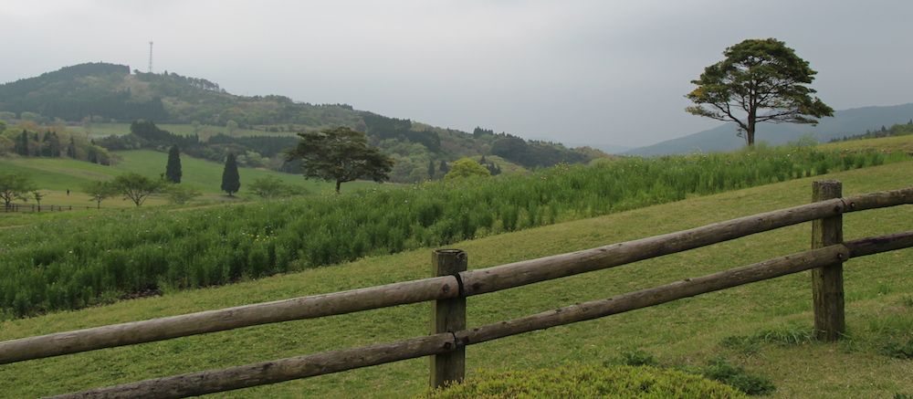

Today we went hiking in the mountains, walking up a mountain to be precise. In a car with 5 people we drove to [Kirishima National Park](http://en.wikipedia.org/wiki/Kirishima-Yaku_National_Park) and climbed (walked) to the top of Takachihono-mine mountain. After waking up at 8am, gathering at about 8:45, a almost 2 hour drive to the mountain, our walk to the top began. Tip for anyone who wants to go up mountains in Japan, buy these sock things that cover your shoes that prevent pebbles from getting in, by the end of our descent my shoes were completely full with pebbles and that was really annoying a bit painful. Unfortunately it has been really cloudy the past few days in Kagoshima, so we didn't get any view from the mountain, but when we were going down, we got to see the crater of the volcano (the mountain used to be a volcano), which was at least something! We also visited a farm there, which is apparently really famous for their ice-cream, but we didn't have any, we just bought some souvenirs (food).

It was definitely a fun thing to do, and I would love to go there again when the sun is out so I can take some amazing pictures! I did take some, so here they are:

