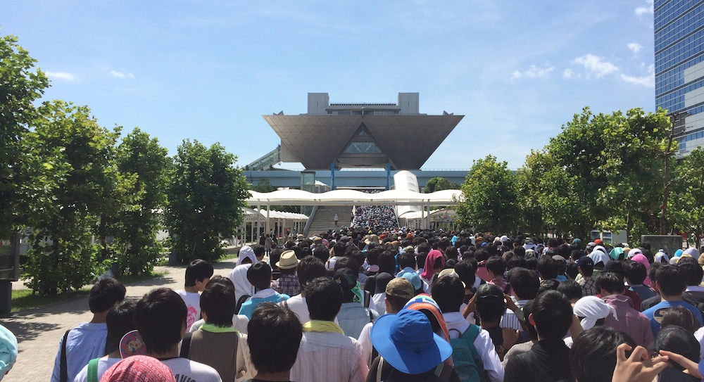

[Comiket](http://en.wikipedia.org/wiki/Comiket) is the worlds biggest anime convention. It is different from cons in the West though, because comiket was originally established as a market place for comics (hence the name **Comi**c Mar**ket**) as apposed to western cons which are more to celebrate the love for anime and manga. These days comiket held at the Tokyo Big Sight exhibition center, a huge building close to Odaiba, and around 500,000 people visit each day during the 3 day period in summer and winter.

<!--more-->If you are into anime and are getting close to otaku level, you definitely know what Comiket is and why it is amazing. I have been into anime for around 5 years now and have traveled to Japan 4 times, but have yet to go to this holy event for all us otaku. This year was my first ever Comiket, and all I can say: "It was awesome! ... but ...".

Before going into detail of what we did there, I would like to sum up my whole experience in one sentence: "You catch the first train to be able to catch the first train (monorail) to stand in line for the opportunity to stand in line for the corporate goods, and then to stand in line for the doujin". So, my friends from UTS and I caught the first train at 5am from where we lived to Shimbashi Station where we caught the first (well technically second, we didn't fit in the first, but they were 3 mins apart) monorail at 5:33am to the Big Sight Hall, then we were put in line which circled around 2 blocks and we waited till 9:30 until they let us move to a new spot where we waited till 10:00 to get into line to actually enter the west hall with the corporate booths. Once we were finally in, we split up so that we could all get the stuff we wanted. Some of us rushed for Type Moon, others for GoodSmile. I am really impressed at how well the Comiket staff handled all the lines and how they break lines up into blocks and send some outside. Getting goods was hard, because all corporate booths which sold popular items had lines which were around a 1000 people long. But we managed to get some stuff; yay!

Moving from the West Hall to the East Hall with all the doujinshi (fan made comics), we encountered a lot of cosplayers and less lines. Though as my comrades tell me, during day 3 of comiket the lines for doujinshi go outside the building and are much larger then the ones on day 1 for corporate; the guys want their "material".

Unfortunately not all of us were able to get the stuff they wanted, and this just goes to prove how vicious otakus really are when it comes to the things they love. And thats the "but" I was talking about in the beginning, comiket being so insanely big makes the people line up for the stuff they want, but at the end of the day, they might just sell out before you even get to the stall.

At the end of the day we went to maid cafe to celebrate a successful day and we drank some champagne (courtesy of Noel).

My photos from Comiket and of the loot I managed to gather:

<iframe class="imgur-album" src="//imgur.com/a/BxF0i/embed" width="100%" height="550" frameborder="0"></iframe>

[Tac's](http://tacyip.com) photos of the cosplayers and the event in general:

<iframe class="imgur-album" src="//imgur.com/a/M2EIf/embed" width="100%" height="550" frameborder="0"></iframe>
