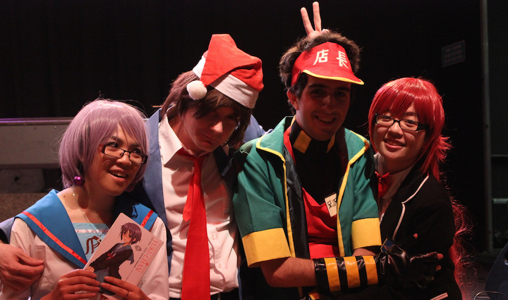

Cosplay, its an art of dressing up as a character from a TV series, movie, game or any other form of media. You get to pretend to be your favourite character, maybe act out a scene or two from the show/game.

My friends from [anime@uts](http://utsanime.net) and [JASS](http://www.jass-uts.com) are doing this thing on Facebook where they talk about their cosplay experiences and tag other people to do it too. So I have been tagged, and instead of posting it on Facebook (ugh Facebook), I'm gonna talk about it here, on my blog.

<!--more-->**Cosplay description:**

1. [Anizawa Meito](http://anilist.co/character/4130) (Anime Tenchou) - the mascot for [animate.co.jp](http://www.animate.co.jp) and a side character from [Lucky☆Star](http://anilist.co/anime/1887). (AnimeSydney christmas party 2012; Madoka Magika Movie 1,2 screening 2012, [AnimeSydney christmas party 2013](https://www.flickr.com/photos/sebasu_tan/sets/72157638191975015/))
2. [Accelerator](http://anilist.co/character/13917/Accelerator-) - [To Aru Majutsu no Index](http://anilist.co/anime/4654) / [Kagaku no Railgun](http://anilist.co/anime/6213)  (Clubs day 2013, SMASH 2013)
3. Business [Kyuubey](http://anilist.co/character/38566/Kyuubey-) - [Mahou Shoujo Madoka Magika](http://anilist.co/anime/9756) ([Madoka Magika movie 3 screening 2014](https://www.flickr.com/photos/jamiejakov/12285623753/in/set-72157642089047773), UTS O-Day 2014).
4. [Haruka Nanase](http://anilist.co/character/83023/Haruka-Nanase) - [Free!](http://anilist.co/anime/18507) (every week at least twice at the Ian Thorpe Aquatic Centre)

**Satisfied with:**

- Anizawa Meito. I just really like the character and his clothes. Whenever he appears in Lucky Star he is awesome, genki and just plain crazy; and I think I am like that too sometimes, so he is perfect. The clothes were bought off eBay.
- Business Kyuubey was really good too. Getting the cosplay together was a bit hard and expensive as I purchased a real vest, shirt and pants. But it worked out and I won a prize.
- I only swim free.... breaststroke and butterfly

**Neutral thoughts:**

- Accelerator. His cosplay wasn't too hard to put together and it was rather fun to walk around SMASH with a walking stick. It was hard walking round with a wig the whole day though, that is the only thing I don't like about cosplays and I stick to characters with black hair.

**Most unsatisfactory:** 

- None yet, pretty happy with all my cosplays so far.

**Upcoming:**

- [Nudist Beach](http://anilist.co/character/87610/Aikurou-Mikisugi) - [Kill La Kill](http://anilist.co/anime/18679), cause why not!
- [Hoshi](http://anilist.co/character/30444/Hoshi-) - [Arakawa under the bridge](http://anilist.co/anime/7647), he is cool and easy to cosplay, just need a guitar.
- [Araragi](http://anilist.co/character/22036/Koyomi-Araragi) - [Bakemonogatari](http://anilist.co/anime/5081), will only do if someone will cosplay as my Shinobu

So now that you have heard about my cosplaying history, thoughts and future. I would like to hear yours: [Ruben](http://rubenerd.com), [Clara](http://kirinyan.net), and [Amy](http://twitter.com/dekopatchi).
