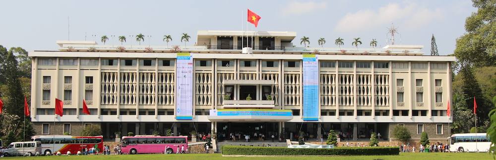

The city of Saigon, or as it is currently known: Ho Chi Minh City is one of the largest cities in Vietnam and has a long history of occupation, war and freedom. Today we had our tour around the most famous parts of the city, such as the Independence Palace, Chinatown, and the War Remnants Museum (you can check [my Foursquare](https://foursquare.com/jamiejakovbot) for the exact locations of the places we visit).

---We began with a visit to the War Remnants Museum where the guide told us the horrible facts of the US/Vietnam War of the 60's - 70's. There were a lot of photos from those devastating times and weapons/artillery remnants left and kept for exhibition in the museum, most of which can be seen on my photos.

Continuing on we went to the Chinese temple and then we were taken for a rather amusing ride on a human ricksha. We were driven all around the center of Saigon, straight through the fish markets, mean markets, fruit markets, clothes markets, and of course the motorbike markets. This city has more motorbikes then there are people in Latvia. Due to the lack of public transport the whole city travels by motorbike and they are literally everywhere. Its crazy, to cross the road you need to just walk between all the bikes and cars; they don't slow down, they don't stop, you just have to avoid them, and they have to avoid you. Its what I like to call organized chaos. Everyone is driving in a manner which most people would say is chaotic, however the vietnamese themselves have absolutely no problem navigating through crowds and around traffic jams. This is one thing that I love the country so far.

After this ride around town we went to the palace of Independence which was overthrown by the communist forces and thus restoring independence to Vietnam (thats where the name comes from). It is now a museum which showcases how the country used to operate under a presidents rule and how it has changed now that the communists are at power.

Here is a photo album of ALL the photos from my trip to Vietnam and Cambodia (latest first):

