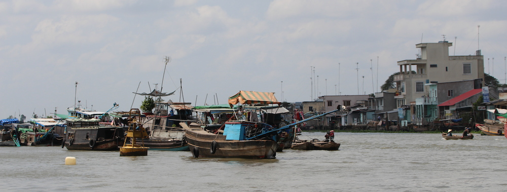

Today we had a boat tour of the Mekong river and various markets and factories on it. These included a candy factory, various rice plants and loading facilities, and other interesting places. Most of the day was just spent on the nice little boat, looking around at the houses and slums of the people living there and taking photos of pretty flowers.

It was a good tour and we got to see and experience the life of normal vietnamese people.

More photos on my:

