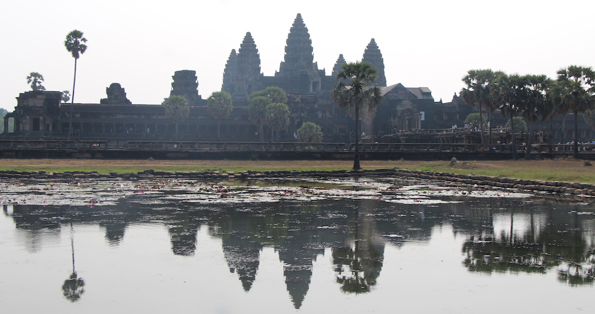

**Yesterday**, on the 3rd day we took a 1 hour flight from Ho Chi Minh city in Vietnam to Siem Reap in the neighboring country of Cambodia. Once we arrived in Siem Reap and got to our  hotel, we were in for a little surprise. Apparently my dad's agent booked us rooms in the so called Privilege Floor of the hotel Borei Angkor. What this means is that we get our own reception on the floor, free minibar refills, a bathtub in our bathroom, complimentary champagne in our bedroom and free access to the Damnak Lounge where we can have free cocktails while watching the sunset. Well basically we are living in a 5 ☆ hotel with like extra service. Even my dad was like: "I did not pay _this_ much!" All the photos are on my flickr~

**Today**, we went on a tour of the Angkor temples. These buildings were built in the 12th century and are still mostly standing in tact! Seeing them left us speechless. We were constantly asking our tour guide: "How did they build them so well in those ancient times?!" There were a lot of tourists all over the place, which is understandable as this is THE most famous place in all of Cambodia. But even so there was enough space for all of us, that just goes to show how grand these temples are! Also it was scorching out there, around 35° C so we had to drink a lot of water and cover our heads. That didn't help us from being drenched in sweat.

Photos here:

