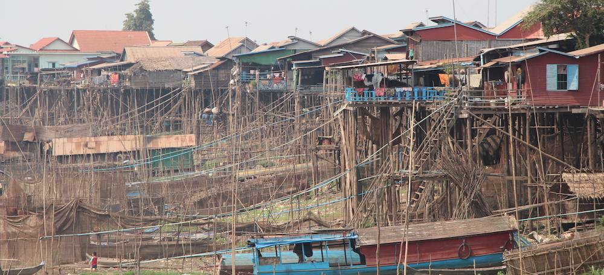

You know Venice right? A city which lives on water. The photo above is not from Venice, far from it, it is from a small city (housing 10,000 people) on the Tonle Sap Lake in Cmabodia. People have lived on this lake for generations and will continue doing so, but one thing that separates this town from any other town is that during summer all you can see are poles, thousands and thousands of poles (and I do not mean people from Poland). Then, during rainy season, the water goes up 9 meters and floods everything in sight. Thats why these people had to build houses on such huge pikes as a foundation for their homes. Its an amazing sight, which you wont be able to see anywhere in the world.

After that we had a very nice spa massage and cocktails while looking at the sunset. This is the life.

Photos:

