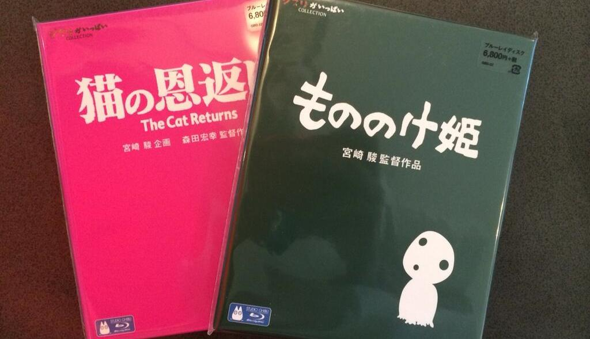

Remember in August [I blogged](/posts/2013/more-ghibli-blu-rays/) that I got _Porco Rosso_? Well today my shipment of two more glorious Blu-Rays have arrived. This time its my second favorite Ghibli movie - *[Princess Mononoke](http://myanimelist.net/anime/164/Mononoke_Hime)* and *[The Cat Returns](http://myanimelist.net/anime/597/Neko_no_Ongaeshi).* This was a present to myself for Christmas and New Years, and also for finishing last semester with good grades.

They have been added to my collection and will be re-watched in due time. As mentioned before, if you want to get me a nice present for my birthday (which I might add is coming up soon), you can always order one of the Ghibli Blu-Rays which I don't have (these 2 + the 5 in the last post is all I got).

З.Ы. This is also my first post of 2014! What a great way to start of my blogging life this year.
