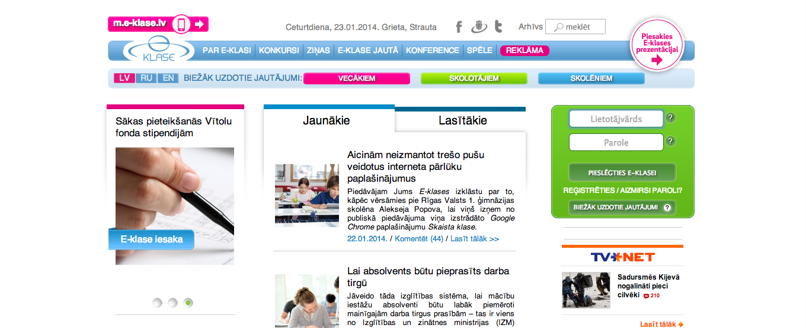
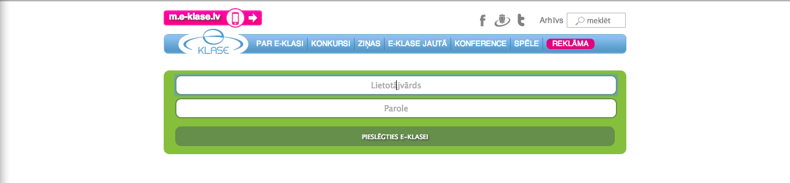

Currently all schools in Latvia are required to use this online grading system called [E-klasse.lv](http://www.e-klase.lv) which is run by the company [DAEC](http://www.deac.lv). When I was still in high school (almost 4 years ago), all the teachers had to put the students marks and grades into both a paper journal and into this online system, but as I have heard from my mother, now they are only using this online system. Of course this has its benefits and makes it easier for both students and their parents to access, but there are also obvious risks as well. Unlike UTS which uses a very complicated and secure system to store all the university students marks, e-klasse is not as big and I highly doubt it is as secure as what my university has to offer. Anyway, that is beside the point, what I want to tell you about is the absurd story that happened to one of our students (former student of Rigas 10th Secondary School) when he tried to improve the user experience when using this online grading tool.

---As you can see now, there is a lot of clutter on the main page, advertisements, useless information, buttons and text in 5 different colors, news articles which none reads anyway, etc... What he sought out to do, is no different from what [AddBlock](http://adblockplus.org) has been doing for years now. He wanted to remove all this clutter from the page and only leave the login and password, as that is the only feature which people use. So he wrote a very simple Chrome extension (seriously anyone with basic HTML, CSS and JS knowledge could do it) to remove all the useless 
 tags and just leave the green login field. Alex made it look like this:

So what this Chrome extension does, when the browser loads the page, it modifies the CSS and sets most of the page to display: none.

`#top_adv_box,#top_adv_box_r,#top_sub_nav,#idx_content,.open_faq,.q, #mn_dbg,#fake_ph_uname,#fake_ph_pass,#slide_wrap,.todays_names, #btn_live_demo,#wall_left,#wall_right { display: none !important; }`

Alex was sued by DAEC for copyright infringement, and they won, as he is only a 16 year old student who doesn't have the means to fight back to large corporation (large - Latvia scale). They made him take down the extension from the store. Legally speaking, he did not hack into the system of DAEC, he did not modify any of their code on their server, he did not sell his extension to people for money, so he did not violate any copyright laws. Modifying a file on your own PC is considered copyright infringement? Really? So if I rename a file on my desktop then I am violating the copyright of the creator? Well if that is the case, something needs to be done about these absurd copyright laws as they are preventing improvement and innovation.

However this brings me to my second point - you can not stop the internet! If something was released that is beneficial to the community, even if the originator was taken down by copyright claims, the distribution will still continue. Someone has already re-uploaded the extension [into chrome web store](https://chrome.google.com/webstore/detail/skaista-klase/ahplccaepejoghfempbfibollddddiaf) and there is a website which allows you to download the [code directly](http://labojam.lv/eklase/). The fight goes on. They can't just stop progress and innovation, they will never win.

Our local Latvian newspaper Delfi.lv has written [an article about this case](http://www.delfi.lv/tech/tehnologii/shkolnika-uluchshivshego-e-klase-obvinili-v-narushenii-avtorskih-prav.d?id=44059813) as well (it is in Russian though, but if you know it - read it)
