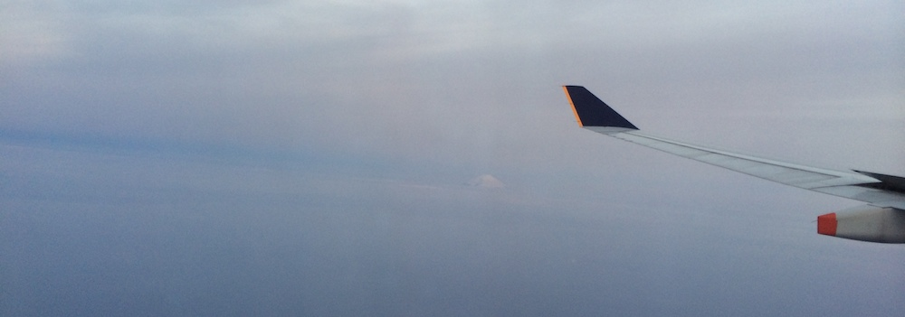

(Photo from the window of my plane, you can see Mt. Fuji)

After a whole 4 years in the planing, 2 months worth of packing and preparation, and a 16 hour flight with 2 stopovers, I have finally reached Kagoshima! Here I will be studying as an exchange student for the next 10-11 months. A big big thanks to all my sempais who helped me out to prepare for this and a thank you in advance to the new sempais I have met here today, who will be helping me from now on.

I have settled into my dorm and just finished unpacking all my luggage. Now for some well deserved sleep. Tomorrow will be a long day of shopping and meeting with teachers.
