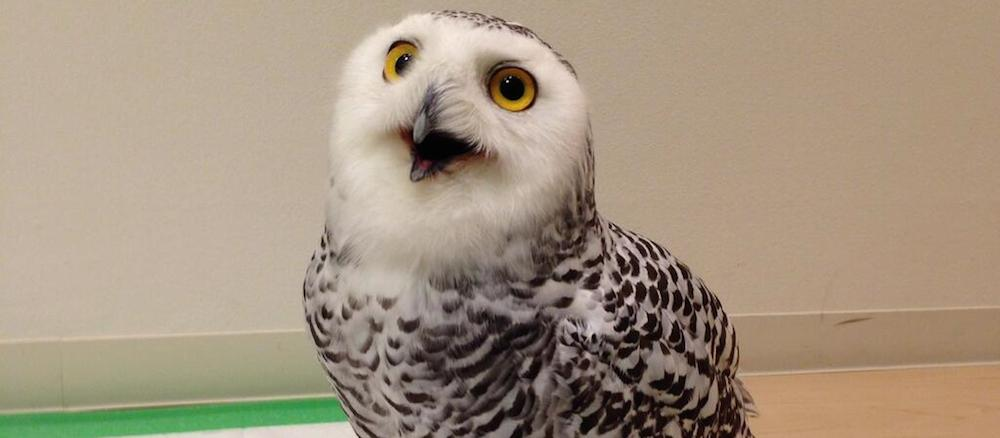
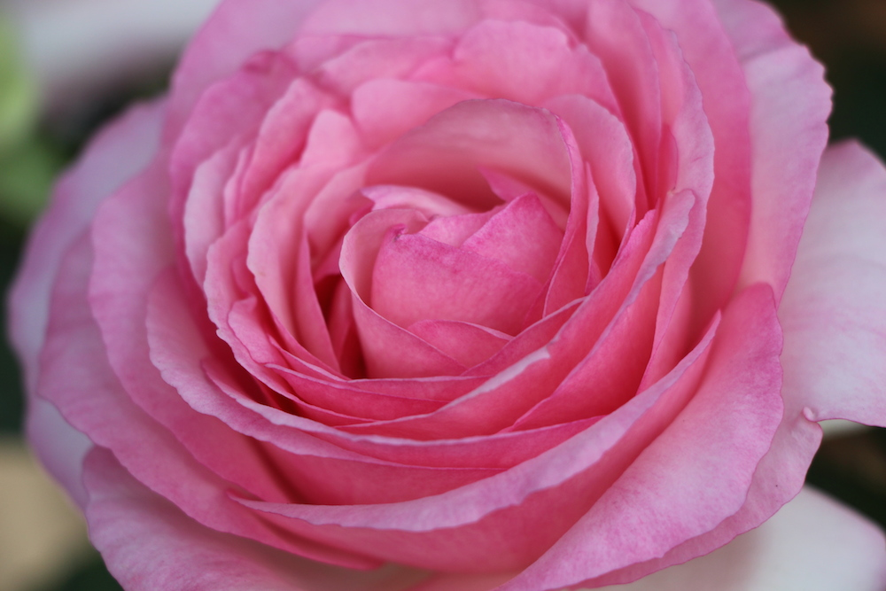

Now that Tac has arrived in Japan last week for the JET program, we can once again go out to anime shops and arcades together! And thats pretty much what we did this weekend. Not quite. It all started in Saga. I came to see [Amy](http://ocarda.wordpress.com) and we went around Saga castle and Saga shrine. Very nice places: pretty, calm, beautiful; just like most of the things in Japan. The next day was more interesting, but also more painful (for our feet). We got to meet up with Tac in the (early) morning and catch a train to Hakata (Fukuoka). There was a rose exhibition there at the station, so we managed to get a lot of beautiful photos of roses! And you know what else they have there? A POKéMON centre! It is beautiful! So many Pikachus, Froakies, Chespins, Fennekins, etc... My love for Pokémon, which I thought to have died when I was 10 years old came back so I couldn't help but spend a bit of money on some gorgeous goods.

---

After nibbling on some [donuts](http://www.misterdonut.jp)  we met up with Kenny, Albert and a lot of international and Japanese students from Kyuushu University (Kenny's Uni). Why did we gather 14 people at 11am on a Sunday in the middle of Fukuoka? To go to the owl cafe フクロウ喫茶! Yes they were real owls! For a mere 1000円 we had a whole hour to play with the owls. By play I mean we could pet them, we could let them sit on our hands or fingers, shoulders and head as well. I like owls, they are both cute and strong. Some of them were pretty big, as you can see by the photos which will bellow.

We played some BishiBashi (Baek and Frank would be disappointed, I failed so badly). We went to the Taito Station arcade and I got to play Ultra Street Fighter IV (only for a bit though, cause we didn't have much time to spare). We went to Mandarake. We went to the Jonny's store, and Amy's wallet was crying after she came out of there. We went to Book Off, where I managed to get some presents for my friends back in Sydney. And we went to the GEE!Store where they accepted my point card which I got 4 years ago; it was still valid!

Overall an amazing day was had. A lot of fun, a lot of sweat and a lot of blisters. My feet still ache. Too bad we can not do this more often as Tac lives 2 hours away and I live 2 hours away.

Here are my photos of the weekend:

