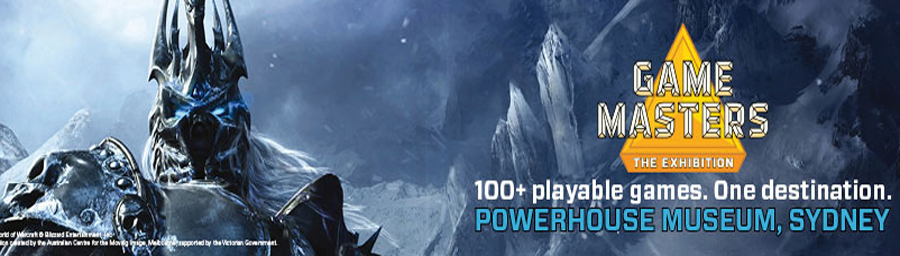

When Amy was in New Zealand there was an exhibition of video games happening there, but due to time constrains she couldn't go. But now that it has come to Sydney she can! And we did! Located at the powerhouse museum, which is just a few blocks away from my place, we got to experience and relive the memories of the games that defined our generation. Games like the original Sonic the Hedgehog, or Legend of Zelda, a lot of old retro arcade games, the Warcraft series + other Blizzard games, Rock Band, Brütal Legend, Sims, etc etc.

It was a lot of fun and a very nostalgic experience for both me and my dear Amy. I wish I could show you some photos from this event, but unfortunately there was a no photo policy. I would highly recommend everyone who has at least played any sort of games in the last 20 years to go and enjoy this trip down memory lane.
