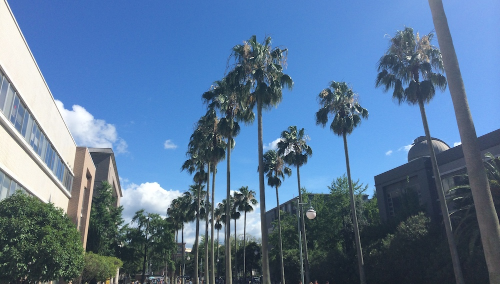

A lot of things a very different in Japan compared to the West, such as their manners, the convenience of everything around you and of course the superb customer service. So when I decided to get a haircut, my first haircut in Japan, I was pleasantly surprised with the service. They sat me down and asked me what kind of cut I wanted while showing me a magazine with various mens cuts which I could chose from. Then once I decided to go with short (like some guy named Kenta in the photo of the magazine) they sat me down on this chair that automatically lowers and rises (adjusts) to the hair washing sink. So he started cutting my hair, very carefully and diligently as my hair is really thick and he didn't want to hurt me. We spent the whole 40 minutes chatting about me and why I am in Kagoshima, with he complimenting me multiple times on my level of Japanese.

So after he finished, the barber pressed a button on the chair which made it spin 180° and stop in front of the mirror. Then the back of the chair started slowly descending so that my head would fit perfectly into the hair wash sink. The guy washed my hair, dried it, combed it and even showed me what the back of my neck looks like with a angled mirror. Then he took me to the door, opened it and bowed to me, while saying that I should come again.

This place also has discounts for foreigners, so the normal 3500¥ became 860¥! Such a great deal and great quality. Would recommend.
