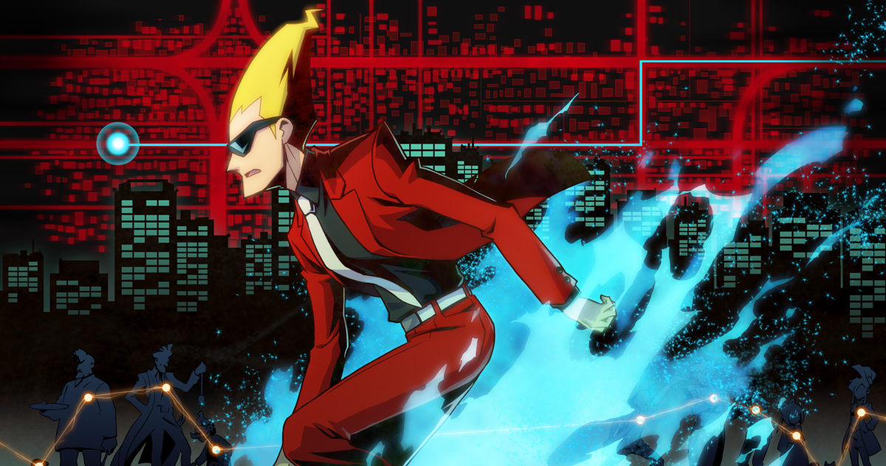

Capcom makes a lot of good games like Street Fighter and Super Street Fighter and Ultra Street Fighter, and .... well you get the gist. Nah, of course they have more good games and one of them is this puzzle detective game called *Ghost Trick.* It was recommended to me by my puzzle loving girlfriend (at the time) [Amy](http://ocarda.wordpress.com) a while back and now I have finally finished it! It was a very interesting story with a nice plot twist at the end. I wouldn't call it the best puzzle game, but it is definitely worth the time. I will write up a mini review without spoilers, because what fun is it playing a puzzle game when the story has been spoiled for you.

---The story starts of with the main character (which you can see in the picture above), who apparently was killed and is now a ghost! And not your ordinary ghost, he has special powers, so called ghost tricks (see where the name comes from) using which he can possess small objects and manipulate them in various ways. Say there was a tire lying on the ground, by possessing it, he can move it a few meters to the right and that will open a path for him to possess mother object. That is not the only power, as you learn in the first 5 minutes of gameplay, he can also go back in time 4 minutes before a persons death and by manipulating objects, prevent it.

This is a very interesting concept and it makes the player think and puts a bit of pressure with the 4 minutes time frame. The mechanics are well implemented, I didn't have any problem with the interface or gameplay. Some of the puzzles are challenging, but most can be completed without to much trouble. The animations are stunning, everything is so smooth and each charter has his own 'move set' - one does the panic dance, the other is this cool dude who flips his cape around and cute little puppy called Missile who jumps around.

Overall its a great game which was originally made for the Nintendo DS, and now has an [iOS port](https://itunes.apple.com/au/app/ghost-trick-phantom-detective/id489113377?mt=8)! I somehow managed to buy all the chapters of the game for only $0.99 so I guess I am lucky. Now its $10.49, oh well. **7/10**

Here is a nice trailer of the game to get you interested.

<iframe src="//www.youtube.com/embed/LwH4ZRyN2B0" width="560" height="315" frameborder="0" allowfullscreen="allowfullscreen"></iframe>
