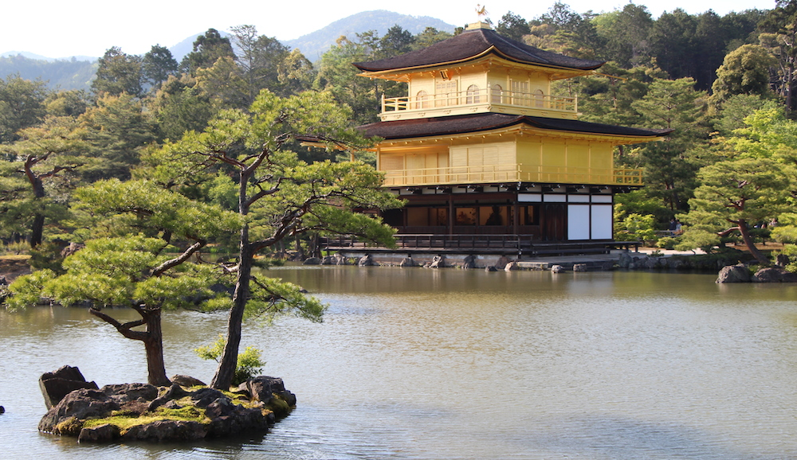
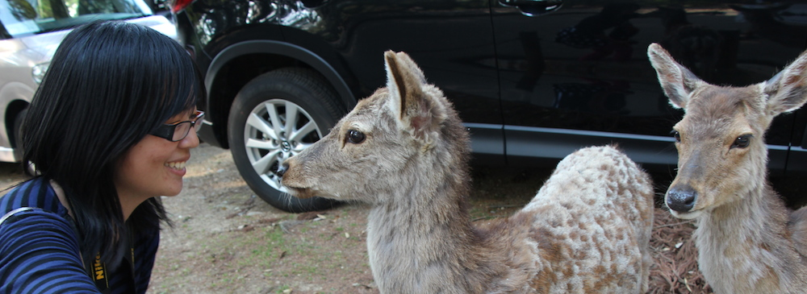

[Golden Week](<http://en.wikipedia.org/wiki/Golden_Week_(Japan)>) is a holiday in Japan which consists of multiple celebrations such as Showa day, Constitution Memorial day, Greenery day, Children's day. It is the time of year, where pretty much all of Japan starts traveling around to visit places that they haven't been to, or places that they would want to visit again. Even though neither Amy nor me are Japanese, we decided to embark on a journey of our own. From the 2nd till the 7th of May we went to Kansai (one of the central regions of Japan) and visited the cities of Kyoto, Nara and Osaka.

---As I have been to all three multiple multiple times I was appointed as the official tour guide for this trip, I hope I didn't disappoint.

First day was a trip around [Kyoto, Fushimi Inari](/posts/2012/kyoto-祇園祭/) and Kinkakuji were our main destinations, with a small lunch break at a delicious soba place in Arashiyama. Our good friend Satoko accompanied us during this trip and it made it just a bit more enjoyable. This time I got to see Kinkakuji (photo above) shine in full golden glory, which I didn't get to see before due to cloudy weather in July 2011.

Second day was a trip to the sacred place that is the building of Kyoto Animation studio. After that we proceeded to the land of deer and temple - Nara. One small problem arose there... There were no deer in Nara on that Sunday. Only maybe 5 or 6 of them were behind the gate and none were found in the park. This is so bizarre, even scary. The ones that were there weren't hungry at all, so they didn't want to eat our sembei (deer cookies). We did manage to find a pair further in the park which was willing to bow for us and so we fed them all the sembei that was in my pocket. Amy tried taking a selfie with the deer, which surprisingly worked out well! Thankfully it didn't rain that day, unlike my first and second time in Nara.

Third day it did rain, and it just had to rain when we went to an amusement park. Hirakata is the city (suburb so to say) where Junichi Okada and his family lives. Because Amy loves Okada so much, visiting this park was a must. The rides were fun and Amy sure enjoyed herself in the shops, I wish it didn't rain though. To finish off the day we went to Osaka Castle and then the Kaiyuukan (aquarium). It was monday - Children's Day, so the whole aquarium was full with children of all ages. Its an interesting and educational place to go to, but sure need a bit more space, or less people.

Fourth day was reserved for anime and idol shopping. From Mandarake to Animate, we went everywhere. We even found an idol shop which had V6 merchandise! After a long day of going everywhere, we met up with my old friend Kosuke for some sushi.

Last but not least was the 3 hour trip to the airport, a 1 hour flight and a 1 hour bus ride till I got home. So tired, so very very tired. But lets do this again!

**My photos:**

