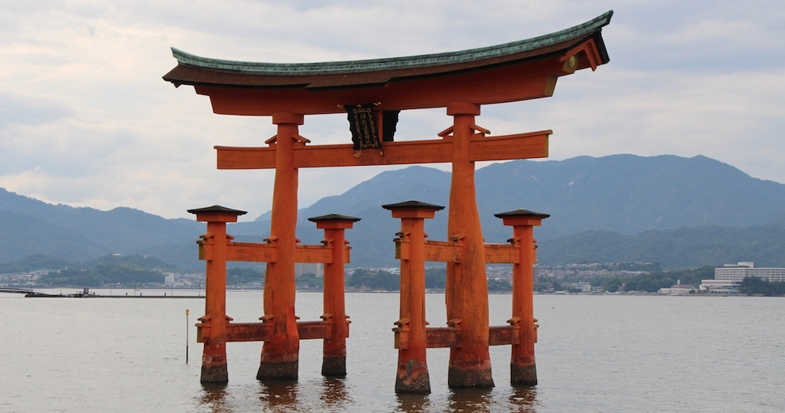

After a relaxing and rejuvenating stay at Kurokawa, Amy and I continued our travels. Now we are heading to the city of Hiroshima, best known for its century old shrine and gate on the water (Miyajima Jinja) and of course the atomic bombing of 1945.

---

Hiroshima is a beautiful city with wide roads and gorgeous green parks, but it wasn’t always like this. After the bombing on the 6th of August 1945, everything within a 4km radius was wiped out with only but a few buildings remaining. One of those is the now world heritage - the Atomic dome. We visited the park of peace and the museum of the bombing. Its such a horrible thing to happen to the innocent people.

Afterwards we took the city tram and the ferry to Miyajima island where the famous Miyajima shrine is located. Such pretty, much photo, wow.

And with this our traveling ended. It was fun, would definitely love to travel some more, but alas, money is not infinite and neither is time. Uni is drawing closer and so is the deadline for our next ICS assignment. But enough about the bad, instead enjoy the photos I took of Hiroshima:

