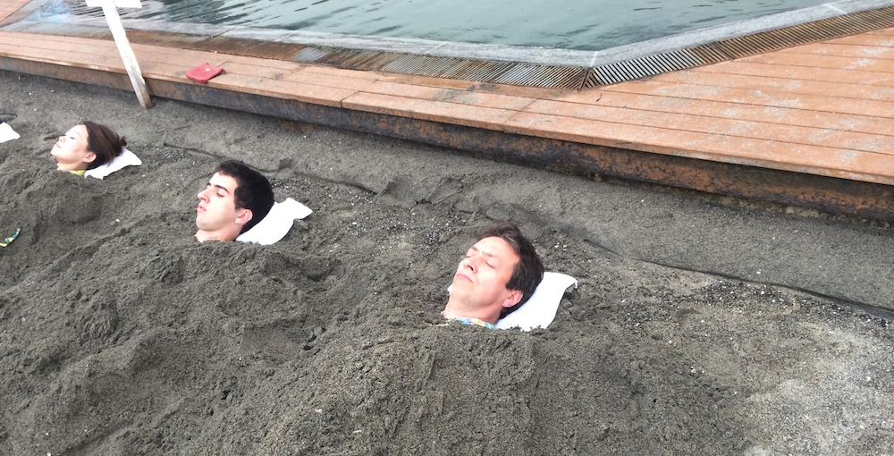

The city of Ibusuki is famous in Kyushu for its hot onsen and of course rejuvenating sand baths. To get a hands on (or butts on in this case) experience, we decided to make the Iwasaki Hotel our main holiday destination. The hotel itself is rather old, probably built in the 70s; the service is ok, nothing special; the food is mediocre and expensive; but the baths are perfect. It is hard to explain what I felt when lying on scorching hot sand (up to 55°C) while covered with hot (but not as hot) sand. Sweat was dripping down my face, my chest was tight and my butt was on fire (from lying on burning sand), but I felt relieved. Lying in this sand helped me relax and it probably has more healing effects on the body which I am not aware of, but it felt great overall.

There were also fireworks in our hotel and on the last day of our stay, after the typhoon passed, we were finally able to sunbathe. You can check out my photos right here:

And Amy's photos here:

