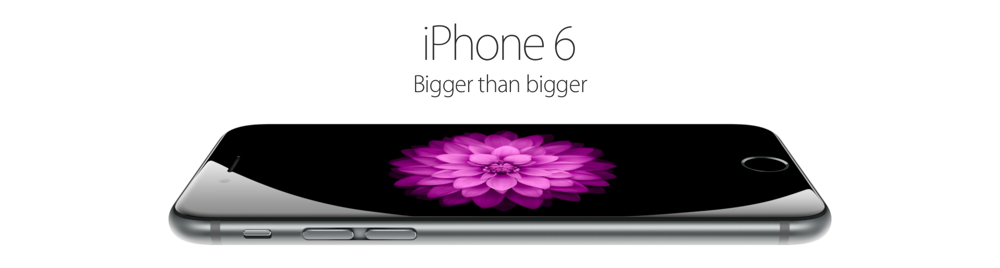

Yesterday Apple announced the new generation iPhone and they had one more thing to say. The [new iPhone](http://www.apple.com/iphone-6/) comes in 2 models the iPhone6 and the 6+ with 4.7' and 5.5' screens respectively. They got a spec bump over the previous generation and a new slimmer design. Thats pretty much it. For features Apple introduced [Pay](http://www.apple.com/iphone-6/apple-pay/), a service which will replace all your credit cards and allow you to pay with your iPhone using NFC. That's awesome, but only available in the US for now.

Then came the big news, Apple announced their first wearable - the [Watch](http://www.apple.com/watch/). The smart watch field is something new to Apple and they decided that now would be the perfect time to try to make one. And they did, and its pretty. Read all about it on their website, they can describe it much better then I can.

Though I would like to say, I would like to buy both the phone and the watch, the iPhone 6 is not worth it without Pay and Australia doesn't have it yet. And the watch is still in its first generation, coming out in Jan or Feb next year. Maybe its worth waiting for the iWatch 2, which will be thinner and better.
