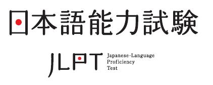

In Autumn of 2013 (March) I set myself a goal. That goal was to buy textbooks, study them thoroughly, take the Japanese Language Proficiency Test and pass it. I am very grateful, that I realized this so early in the year and had more than enough time to prepare for the exam which was on the 1st of December.  And now I got my results back, and guess what - I PASSED!

I had a lot of time to study and I spend countless hours on learning kanji, vocabulary and grammar. And it payed off! The exam was hard, like I don't usually call exams hard and challenging as they are usually really easy for me even without studying, but this was. I put a lot of effort and I achieved the result I wanted. Usually I am not that excited for my success cause that is just the natural progression of things - I do not fail. But this time I was very very very happy to see my pass, as I know I had to put in a lot of work to achieve it, whereas normally it would just come to me anyway.
