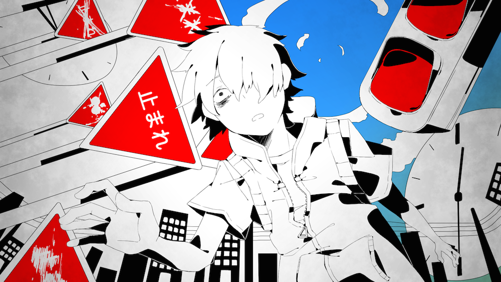
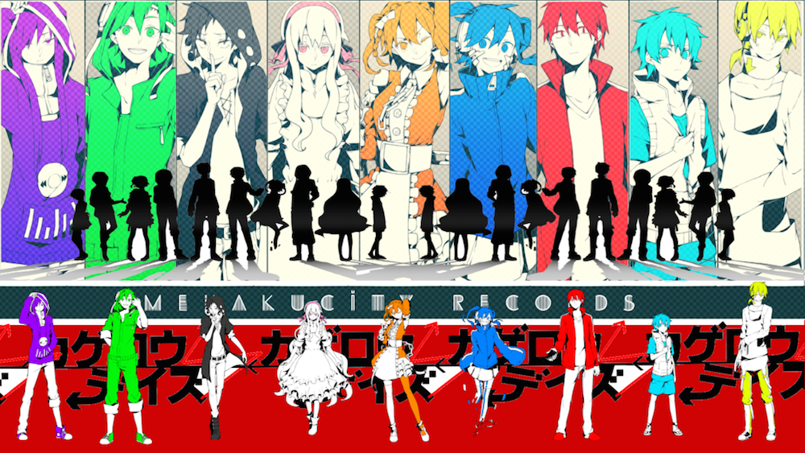

As the spring season of 2014 comes to a close, I would like to take some time and write about one of the (I would like to say best, but I can't) coolest anime of the season - [Mekakucity Actors](http://myanimelist.net/anime/21603/Mekakucity_Actors). Usually anime is based on manga, light novels, games, or is original story, but not Mekakucity (it was but not entirely), this anime was based of a [series of Voclaloid songs](http://www.youtube.com/playlist?list=PLnG3LHAsVLPVezo4G3jhrmNSISu45cGDl 'Playlist of Kagerou Project') called Kagerou Project (SPOILERS for the series, watch at own risk) made by Jin and posted on [NicoNicoDouga](http://www.nicovideo.jp). Though the original songs were adapted into a series of light novels and a manga, the story of the anime, same as the LN and mange took a turn in its own direction in places, showing of things that you could not see in the other media.

---A simple explanation of the plot with no spoilers: Basically there is a group of people who have special powers, which are activated using their eyes. Through a series of events they get to meet each other and form the Mekakushi Dan. During their interactions they learn more and more about their pasts and how they got the powers, like connecting pieces of a puzzle, they all learn of the true nature of the world and what they need to do in order to survive. The story itself resembles that of [Durarara](/posts/2012/durarara-review/ 'Durarara review') in a way that there are a lot of characters all with their own backstory, and their fates are all connected. While watching users will feel confused as the episodes constantly shift from plot driven to backstory oriented. Let me just say that if the first season of Haruhi in broadcast order was confusing, then this will be a rather similar experience. But without these mysteries the series would not have been as enjoyable as it was.

So far I have been praising the plot, and the songs. The original vocaloid songs are just beautiful. They are very well made using Miku and IA as the main singers, with stunning art and backgrounds. So to all you Vocaloid fans out there, this is a must. Continuing on to the anime, the anime was made by [Shaft](/posts/2013/music-monday-based-shaft/ 'Music Monday: >Based SHAFT'), as you know them for Bakemonogatari and Madoka, so you would expect them to do a good job. And to be honest, for the most part they did. They were cought between finishing NiseKoi from last season and Hanamonogatari for this season, which they delayed, so its understandable that making Mekakucity was hard on them. The animation did drop quality a few time, and at some points the flow of the episode felt either really slow or very rushed. In all honesty I think the anime adaptation was not that good. It gave insight into the story of Kagerou Project and definitely proved to be entertaining, especially with all the unanswered questions. But I do feel like Shaft could have done a better job at adapting this amazing series, especially since they had so much material to work with! The characters weren't that good either, they had barely any development (well depends on the character) and so many things were taken for granted.

That said, I would definitely recommend this anime to people who like a mystery and enjoy stories which can not be fully answered. The anime should spike your interest to read the manga and light novels, or at least listen to the songs.

The anime I will give a 7/10 as it had its good points too.

The story though, and the overall series (songs, manga, light novels, anime, merch) definitely gets a 10.

