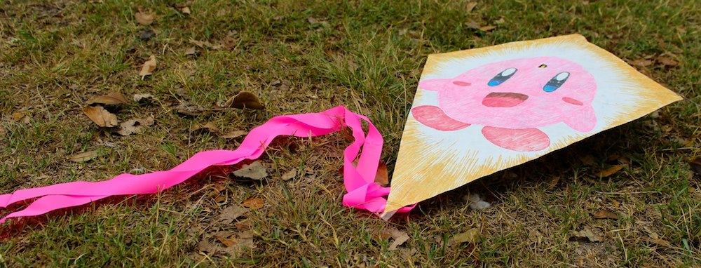

26th of January - Australia Day. Its a day of celebration, aussie BBQs and kites! Drawing Circle and the Japanese Australian Students Society (JASS) had a joint event at Centennial Park which was a sort of BBQ / drawing session and kite making workshop. Around 20 people came and overall it was a great joint event, even though it was rather cloudy (with a chance of meatballs).  But that didn't stop multiple groups of aussies gathering together with their family and friends to celebrate this day together.

For me though, it was a good opportunity to catch up with people who I missed and couldn't see due to me being constantly busy with work. And so I did. Too bad my lovely girl couldn't be there with me on this funtastic day, but I got to spend a whole day with her before for our 4 month anniversary. We watched anime, had lunch, went to Kino, and drank some good white wine.

<!--more-->During the event we had sausages, burgers, a huge variety of sauces and drinks! There was also a football-ball which we could play with (and so I did, tried to show off my skills which I picked up while playing бананы with Гера & Гера). It was fun, I didn't have time to make a kite though as I needed to leave early. Would do again.

Well here are photos which I took (have I ever told you that I don't like taking photos when its cloudy):

Oh and also my close friend, an photographer with more experience and skill then me with a camera, uploaded his batch of photos. Here is a link to his album:

