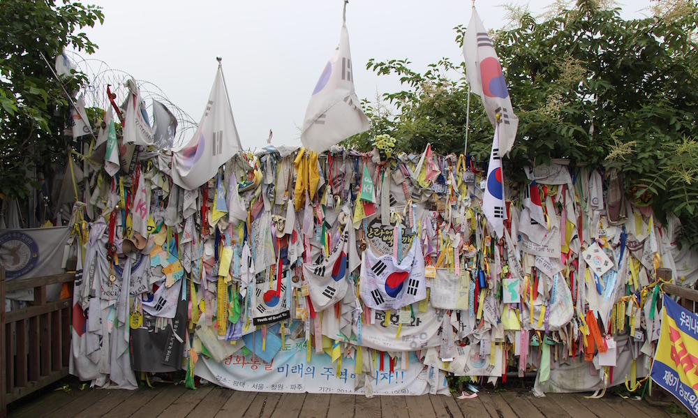

For the past 5 days I have been traveling around Korea with my girlfriend and her mother. We visited the port and beach town of Busan, the capital Seoul and took a tour to visit the [Korean Demilitarized Zone](http://en.wikipedia.org/wiki/Korean_Demilitarized_Zone) (DMZ) at the border with North Korea.

---In Busan we visited a buddhist temple, which had a golden Buda and two of the cities famous beaches which gave us a glimpse of the night life of Korean people.

After taking the bullet train to Seoul and walking around for a bit, it was evident that we have arrived in the capital of the mighty country known as South Korea. The streets are wide, there are much more people around, more cars, and it was much cleaner then Busan. We took a day tour to the DMZ and even crossed the border into North Korea (for 10 minutes) at the [JSA](http://en.wikipedia.org/wiki/Joint_Security_Area). I was surprised to see just how string the influence of the US army is on the border of the two Koreas. There is a big US military base and they have over 100 soldiers stationed at the border.

Returning back to Seoul and spending the days just walking around the city, visiting a number of tourist spots and universities, we got to see just how the Korean people live, and I can say it is definitely worse then Japan. Much better then any other asian country I have been to, but definitely nowhere near the quality of life that Japan has to offer. I'm talking about the cleanliness on the streets, the attitude of the people, the convenience of transport (the metro system is ok, but our tickets wouldn't work every single time, cause the IC card reader had errors), and of course they way they drive. If I had to compare Seoul to any other city I have been to, I would say it is very similar to Kiev. There are old and dirty parts of the city, there are amazing and expensive new one, there are cultural districts, there are shopping districts, people aren't that friendly, but they were helpful at times.

Overall the trip was full of experiences and Korea is definitely an interesting country, but I doubt I will be ever coming to this side of Korea again. But North Korea is on my radar as a future travel destination.

Here are photos of this trip:

