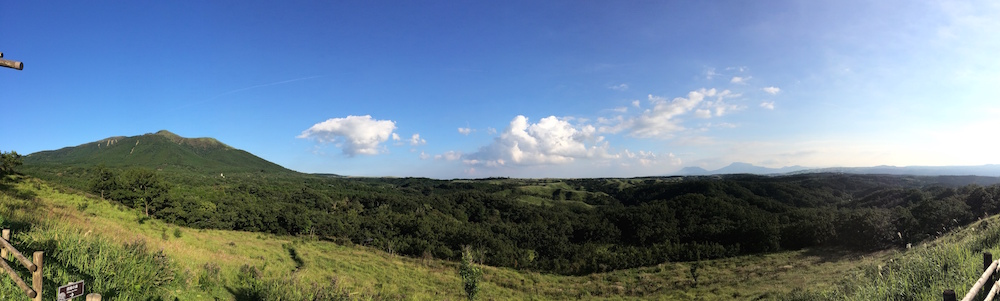

Summer holidays are not over, and neither are my travels. This time Amy and I set on an adventure to venture into the mountains of Kumamoto prefecture, into a small town called Kurokawa onsen. It took us 3 hours to get there by bus from Kumamoto station; it was a long ride, but totally worth it.

---

What is so special about this place you might ask? Well as the name implies, this is a hot spring town. Its full of of ryokans (Japanese style inns) and onsen (hot spring baths or spas). The town has retained most of its traditional look, there are no convenience stores or tall concrete buildings. Only small wooden inns and baths.

We spent 2 nights there and went to a some of the onsen. It was definitely worth the time and the money. This is a once in a lifetime experience. You get to completely immerse yourself into the surroundings and relax in the outdoor baths overlooking the river. The inn you stay in will provide you with a yukata (summer, less formal version of a Japanese kimono), which you can wear while walking around town. We also got a delicious Japanese style dinner at the inn both days we stayed, which included shabu-shabu, yakiniku, fish, miso, sashimi, and a lot of small things on the side.

There is also a mountain which you can walk on top of (2km walking trail), which has an amazing view of the Aso volcano range and the valley underneath it.

Overall it was a great experience and I would recommend everyone to try it out. Though the ryokans are a bit pricy, we ended up paying 33,000Yen each for the 2 night stay.

Also here are all the gorgeous photos from the trip:

