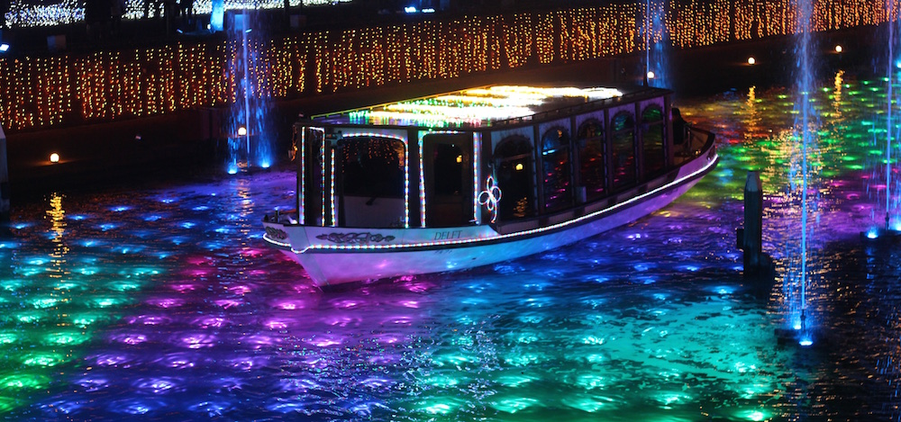
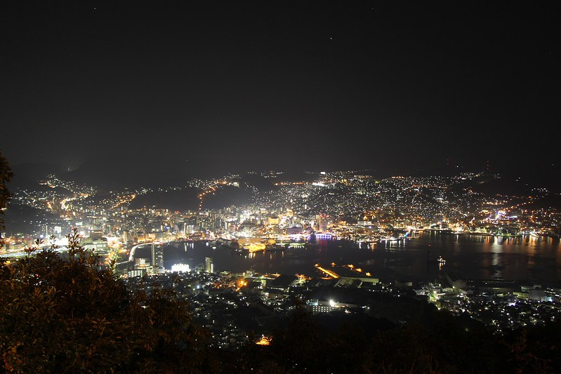
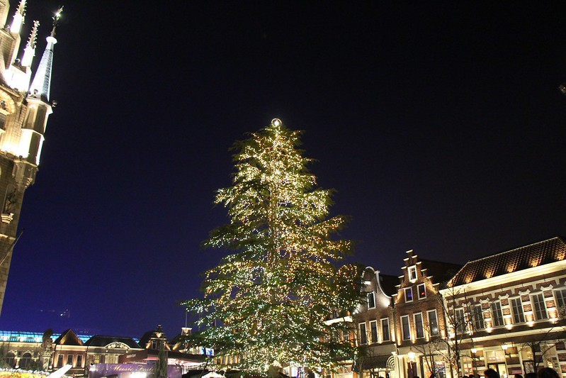
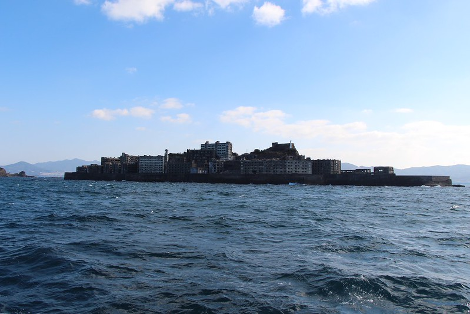
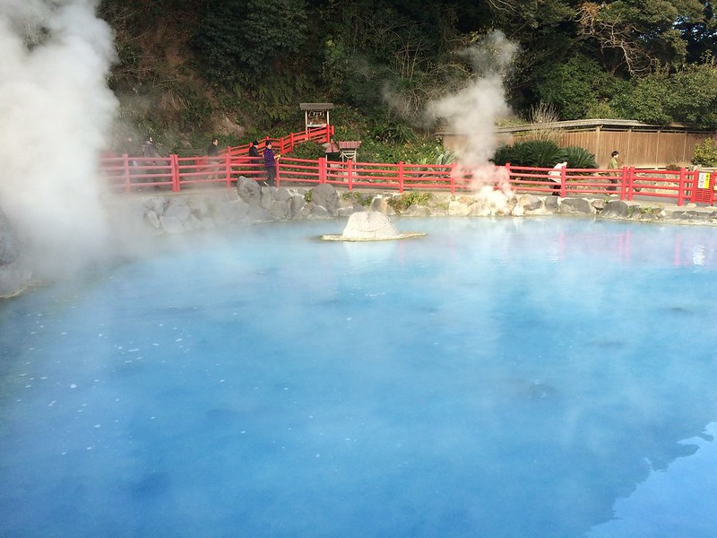

This winter break being far away from home, far away from our families, Amy and I went on an adventure around Kyushu to see everything it has to offer. For our 6 day trip we, went to Nagasaki and the deserted island of Gunkanjima, Huis Ten Bosch theme park, Beppu city and the town of Yufuin. I'll try to write up as much as I can, but it is late and we are sleepy.

---**Day 1 (23rd Dec) - Nagasaki**

After reaching Nagasaki at around 4pm and checking into the hotel, we were thinking of what to do, where to go. Luckily [this little website](http://www.japan-guide.com) had an answer ready for us. They say that the night view of Nagasaki city is worth a million yen, maybe for some, but for others I think it is worth a bit less then a few thousand. It is definitely gorgeous; all the shining lights in different colours looked like stars in the distance.

**Day 2 (24th Dec) - Nagasaki Atomic Bombing Museum & Huis Ten Bosch**

This was my second time to Nagasaki, and second time to the Atomic Bombing museum, so I will only briefly say that I hope such a thing will never happen again.

In the afternoon we proceeded to the Dutch theme park - Huis Ten Bosch located close to the city of Sasebo. It is honestly a very impressive place. The moment we walked in, I felt like I was back in Europe. Maybe not Latvia, but still Europe. It was strange seeing all these Japanese people walking around as I was completely immersed in the feeling of Europe, this feeling of home. It was pretty impressive during the day, but it got so much better in the evening. The sun went down, and the town was covered in darkness, when suddenly all the lights went on! Everything: the houses, the church, the tower, the roads, the bridges, even the grass lit up in gorgeous colours. Thats is what I call a light show. We had a (kinda)real European Christmas.

**Day 3 (25th Dec) - Gunkanjima**

Hashima island, also known as Gunkanjima (battle ship island) used to be a coal mining plant and home for over 5000 people. It became famous world wide after about 20 years after it closed down in 1974 (and also because of the movie Skyfall). The island is just full of broken down building as ruins of the once great mine. And it was recently opened for tourists to explore. Of course visitors are not allowed inside the old rusty buildings as none knows when they will collapse, but we still managed to get a lot of great shots of this forgotten place.

The rest of the day was spent visiting temples of Nagasaki and photographing everything we could.

**Day 4 (26th Dec) - Sleeping in Saga**

Went back to Saga, slept most of the day, watched TV, ate food. Not that exciting? Traveling is hard work! We needed a break.

**Day 5-7 (27th Dec-29th Dec) - Beppu and Yufuin**

Beppu is famous for its hot springs (geysers/"hells") and Yufuin is just a quiet mountain town with a bunch of onsens (hot springs/spas). Seeing the "hells" and bathing in the onsens makes you think about how amazing our Earth truly is. You can't find this anywhere else in the world, and it is an essential part of Japanese culture. I am glad we had the chance to embrace it, even if it was only for a few days.

Finally, I would like to wish a everyone a Happy New Year! 2014 will be over in just a few days, so get ready to embrace 2015 and all that it has in store for us.

As usual the photos from our trip can be found on my

