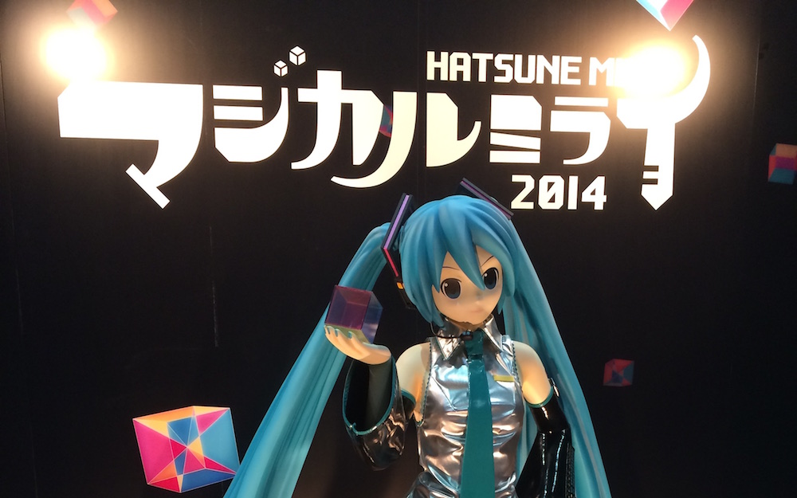

[Happy birthday Miku](/posts/2013/happy-6th-birthday-miku/ 'Happy 6th Birthday Miku!')!! You have been with us for the past 7 years, singing amazing songs which we will remember forever. And of course good work with the concert yesterday. It was amazing!

This year was the second Magical Mirai, this year held in both Osaka and Tokyo. Together with [Tac](http://tacyip.com), [Dale](http://twitter.com/dell19930), and [Mary](http://grassisgreenerdesu.wordpress.com) we went to see Miku preform live on stage. But not only did we get to see an amazing performance, but there was also an exhibition of Vocaloid related art, goods, and other things.

---

Even though we arrived at the event hall a good 3 hours before the start of the concert, the exhibition has been going on since morning and thus a number of items that we were interested in, were already sold out by the time we got to the shop. That was rather unfortunate, but that just goes to prove that same as in during [comiket](/posts/2014/comiket-86/ 'Comiket 86'), there is a lot of people willing sacrifice their time for these goods.

After looking around and collecting all the free loot, we went in for the concert. Being tall helps a lot! I was able to see the stage without any kind of problems, even though we were in row 31. The opening song made me already super pumped as it was one of my [favourite tunes](/posts/2014/kagerou-project/ 'Kagerou Project') the past year. And hearing and seeing Miku "live" fulfilled my dream.

I am really impressed in how much all the animations have improved. All the movements of the vocaloids were smooth and super realistic. And the costumes they wore were really cute.

Overall it was an amazing experience, that good that I would love to go again!

As we were not allowed to take photos or video during the show itself, all the photos in my album are of the exhibition and outside:

