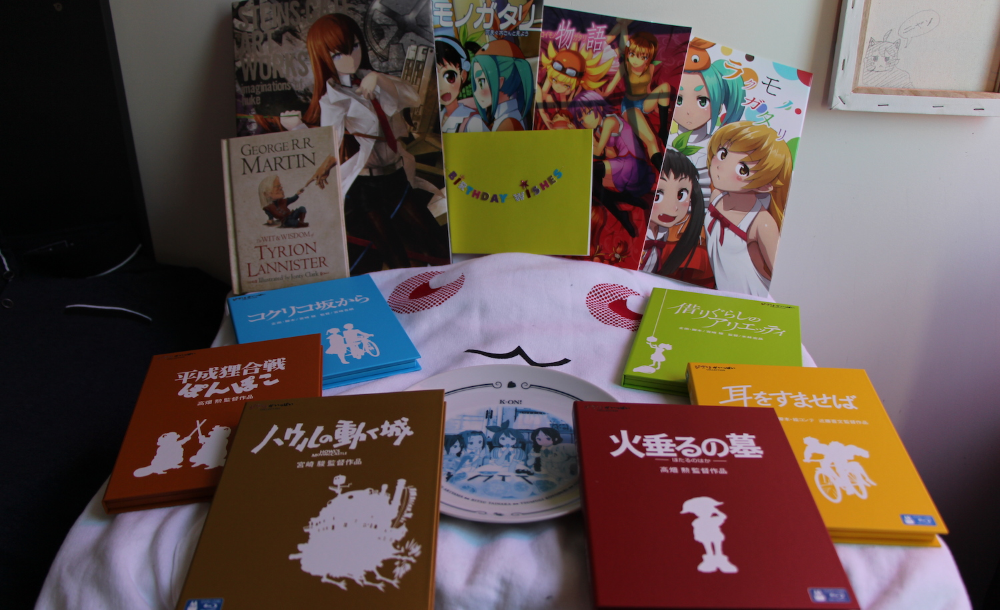

This year I have officially become an adult (in every country); I turned 21! Every year up until now I got to spend this special day with my 2 most special people - my mommy and my daddy, but this year we did not get the chance to meet up to celebrate it together, but nevertheless I had a great day with my friends - yay!

---

**Part 1 - Madoka**

1st of February did not only mark my 21st birthday, but also the first time the _[third Madoka movie - Rebellion](http://myanimelist.net/anime/11981/)_ was screened in Australia. The anime clubs of both UTS and UNSW attended this event and we all lined up at the cinema at 12 to pick up our very own signed boards! I got [Godoka](http://www.flickr.com/photos/sebasu_tan/12265772186/in/set-72157640415513774) /so happy. The movie was amazing to say the least, [Ruben](http://rubenerd.com/madoka-magica-rebellion/) and [Clara](http://kirinyan.net/madoka-magica-rebellion-vadim-s-birthday/) have both blogged about it, so you can read up on their impressions. There was also a cosplay competition, which the didn't announce, but I was ready for it anyway, some people dressed up as [madoka characters](http://www.flickr.com/photos/sebasu_tan/12265641934/in/set-72157640415513774) and I won the grand prize (BluRays of the Madoka series signed by the english VAs) with my [Kyuubey cosplay](http://www.flickr.com/photos/jamiejakov/12285623753/).

**Part 2 - Dinner at Casa di Nico**

At 6pm we gathered at a nice Italian restaurant in Darling Harbour. I had 20 people join (apologies Ruben and Clara) who came to my party and this one of the memorable days of my 21 year old life. We had pizza, pasta, whine, cocktails, deserts and a lot of gift wrap..... Ok let me just say this, who ever though it would be a good idea to wrap my presents in 2 full rolls of wrapping paper, going for about 10 layers is a bloody .... GENIUS! It made me crack up and face-table myself twice. Finally after about 5 minutes of unwrapping I got to see my Ghibli BluRays there. Now I have Grave of the Fireflies, PomPoko, Whispers of the Heart, Howls Moving Castle, Arietty and Up form Poppy Hill to add to my collection, totaling in 13 Ghibli BluRays overall out of the 20 Released (1 coming soon). So I a whole lot closer to completing my collection! Also thanks to Seb and Cindy for the Steins;Gate art book - so much Kurisu, I am dying, and the Tyrion Lanisters wit and wisdom book, I will go though them and try to be as witty. Thanks to Cindy for the beautiful orange flowers. Thank you so much to all my friends who came! Lots of hugs, lots of kisses, and lots of fun.

Photos from party:

<iframe src="http://imgur.com/a/EDkHd/embed" width="100%" height="550" frameborder="0"></iframe>

**Part 3 - Kenny's Birthday on the 2nd of February**

I want to wish Kenny a happy happy birthday, as she was there celebrating with me the night before her own big picnic-party. It was an awesome day, thanks for organizing and inviting. Also thanks to [Dale](http://twitter.com/dell19930) who went to winter comiket and got me those amazing looking Monogatari doujins of my favorite lolies - Shinobu, 89ji & Ononoki. And the Kyuubey hoodie, I will try my best not to get it dirty as it is pure white! And here are the photos from the Botanic Gardens:

