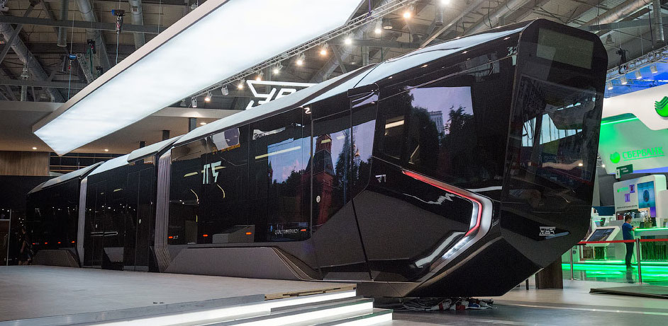

The world is innovating, you can see signs of new futuristic technology everywhere. From smartphones and tablets to self driving cars and climate control cities. This thing you see is also a small glimpse of the future, the future of Russian transport, more specifically trams. It is called [project АТОМ](http://okbatom.ru) and this tram is designed to be a new standard for all trams in Russia within the next 3 years. This project caught my eye, when someone on reddit linked to this [guys livejornal blog](http://zyalt.livejournal.com/1112328.html) where he explains how this home made (90% of parts made in Russia) is a breakthrough in Russian transport systems and when it gets implemented it will change the way people use trams in big cities not only in Russia, but also all over the world.

The design of the tram both outside and inside is black, with grey and brown seats inside and linoleum flooring. In all honesty I like the design, but not a big fan of the color, I think they should make it a bit brighter as black is rather frightening, especially at night. The tram reminds me of something from Robocop or Judge Dredd.

What do you think, should this sleek, black coated futuristic apparatus be put into mass manufacturing and set on the streets, or should they re-think their design?
