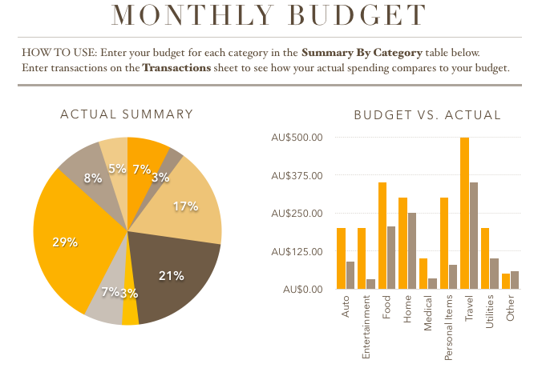
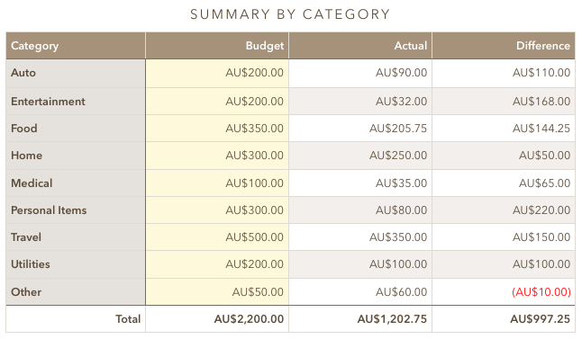
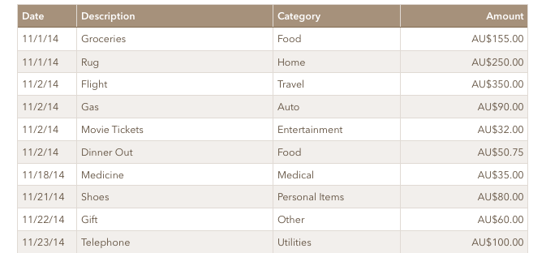

My new years resolution was to be more organised and get more control over my money. And the one thing that helped me achieve this goal was the App - [Numbers](https://itunes.apple.com/au/app/numbers/id409203825?mt=12).

Even though I masterly avoided using any Microsoft software throughout university so far, ever since I started working, I was required to use Word, Excel and Powerpoint. Mainly when dealing with numbers and calculations, I was told to use Excel, even though I have never used it in my life (never had the need so to say). Well That help me get an understanding of how spreadsheets work, but to be honest, it wasn't a very pleasant experience. Of course many people will argue that the functionality of Excel is all that matters, but alas no, if the design is bad, then I don't feel I want to use the application any more then I have to.

<!--more-->This is when my good friend Max (Muzaffar), accountant, showed me how he handles monthly expenses and budgets. It was beautiful. Rows and columns of integers and floats, descriptions for all the expenses, etc. And not to mention it, he is also very good at explaining how things work and why you have to include a certain formula to achieve the desired result. I owe Max big time for introducing me to this concept of keeping track of money using spreadsheets.

So I decided to start one up myself. First using some 3rd party App for the iPhone, but then later on moving onto Numbers. First of all Numbers already has a template for managing budgets, which was immensely helpful as it already had all the formulas that I wanted, except for a few. Then with a few tweaks, design changes and edition of a calendar I created a budget tracker which was perfect for me! Its very simple to use. On the Transactions tab you just add the date, description, chose the category (from a pre made drop down), and input the value. Thats it, using this data, the table (which can be seen in the image above) calculates which category the money belongs to and increments the Actual amount, then calculating the different left.

I would recommend anyone who want to keep an eye on their savings and spendings to use Numbers or Excel or Google Docs, as this may help in the long run when you wonder - "where did all my money go?", or  "what should I spend less money on next month?"

