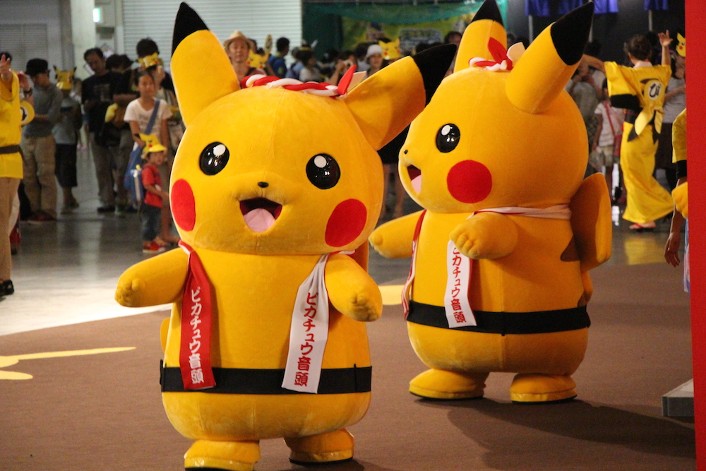

The rest of my trip to Tokyo this year included seeing, touching, hugging, eating and buying Pikachus. Im serious, I did everything imaginable to those pikachus.

---

On the 16th of August, after an exhausting day at Comiket, Amy and I visited the Pokemon the Movie XY Exhibition in Roppongi Hills where we could see the art for each movie and some notes by the directors. But the main reason for us going there was the [Pikachu Cafe](http://wahutimes.com/pikachucafe). Once again, in real Japanese fashion were faced with a queue, for 2 hours we waited for the chance to eat pikachus! And then we did! Pikachus are delicious, they taste like mango. Photos down below.

The 17th of August was the day for our trip to Yokohama. But it wasn't for just travel purposes, it was to search for living breathing pikachus! (well they were some guys in pikachu costumes, but still alive). This event is to promote tourism in the area and has been a big success. Everyone wants to see the [pikachu invasion](http://en.rocketnews24.com/2014/08/12/pics-of-pikachu-packs-from-a-day-of-pokemon-hunting-in-yokohama【video】/). Even though we didn't see almost any pikachus wander around the streets, we saw them dance the Obon dance, it was beautiful!

Also Yokohama at night is just gorgeous, the lights and the Ferris wheel all combined together in the port view is just something you need to see for yourself.

My photos from both days:

<iframe src="//player.vimeo.com/video/104280977" width="700" height="393" frameborder="0" allowfullscreen="allowfullscreen"></iframe>
