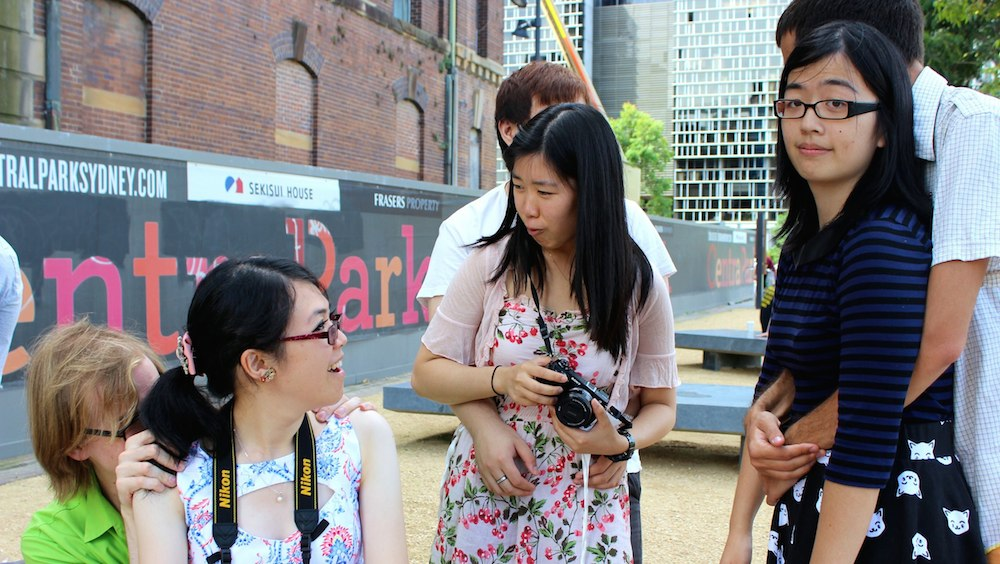

Visa and plane tickets have been acquired, packing has been done, all my boxes have been moved to my [Imouto's](http://twitter.com/taccarin) and [Lexi's](http://twitter.com/maidforclass) place, and now all the farewell lunches, dinners, and parties are now done. I have 1 day left in Sydney and then I am off to glorious Japan.  Thank you to all my friends who took the time from their busy lives to meet me one last time this year, before I head off. Thank you for giving such a wonderful experience in so many different restaurants. Thank you to the anime club, drawing circle and JASS people (especially Ritchi) for organizing a farewell party last week before the [Kyary concert](/posts/2014/きゃりーぱみゅぱみゅ-live/). Thank you to all my friends from urbanest, all my Russian friends and my friends from back home for this last week.

Also 2 of my closest friends had their birthdays this week. [Ruben](http://rubenerd.com) and [Tac](http://twitter.com/taccarin).

---

First, big happy birthday to Ruben-sempai! You're now as strong as 28 bulls, as wise as 28 books, as funny as 28 puns, and as old as 28 new born babies. Wait wha? ^\_^ [High tea](http://rubenerd.com/a-birthday-tea-cosy/) at the rocks was very nice, we should do it again, must try all the teas!. Good luck with your studies and see you in Japan! And please don't run off to Singapore before I come back to Australia. Don't leave me sempaiiiiiii~~

Next Tac. My bro, my imouto, my sempai. I have so many names to describe you. You are soon going to be even older then you were last year! And this isn't even an april fools joke!  I got to spend a whole day with you, and thats exactly what I needed. I am happy to see someone else who's room looks a lot like mine (in terms of posters and number of anime goods). I am happy that I have a friend who takes pride in what he enjoys, thats what I respect in people. Anyway, happy birthday Tac, really looking forward to spending time with you in Japan. And to say thank you for keeping my stuff, [drinks are on me](https://www.flickr.com/photos/sebasu_tan/sets/72157643106611814/) next time ; ) (PS: Don't forget to consult the Helix Fossil! It knows the answers to everything).

Of course thank you [Amy](http://ocarda.wordpress.com) for being with me pretty much every day and helping me get all my packing done. I will see you off and next time we meet will be in Saga, when I come over in a week or so.

Well, I'm gonna go now. See you people in February 2015. I'll keep posting, so please keep reading!

PS: This Kyary song sums up my feelings for leaving perfectly. Its not goodbye, it see you soon ([Lyrics](http://www.jpopasia.com/celebrity/kyarypamyupamyu/lyrics/pamyu-pamyu-revolution/chan-chaka-chan-chan::120228.html)).

https://www.youtube.com/watch?v=0j9ddmHa2Fg
