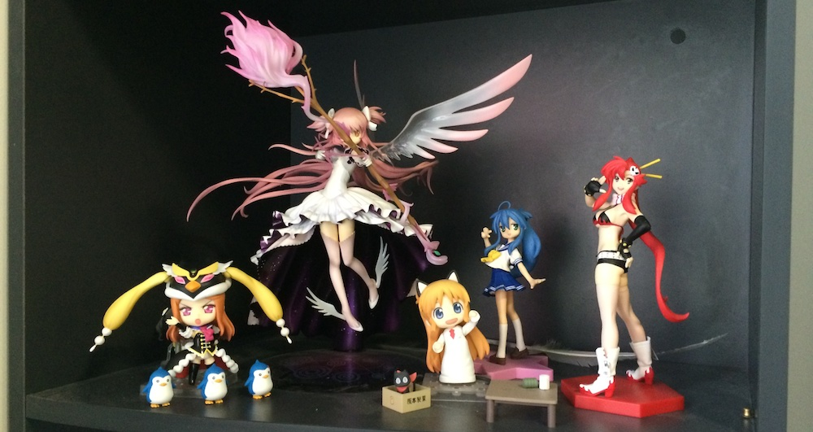

Yesterday I started putting away all the figures that have made my shelves their home. Now they are back in their cramped up boxes and those boxes are in another box (Yo DAWG~). Now my shelves are so empty and soon my whole room will be as well. It is sad to leave the place that you called home for over 3 years now, but I must look ahead and welcome my new place in Japan!

Today I must start sorting though my endless pile of clothes to pick what I can give back to my parents to take back to Latvia, what to leave in Sydney and what I need to take with me to Japan for my ICS. This will be tough task, but somebody's gotta do it!
