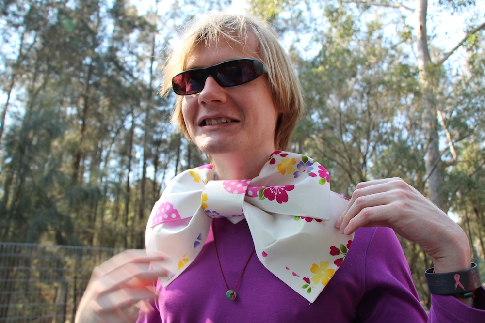
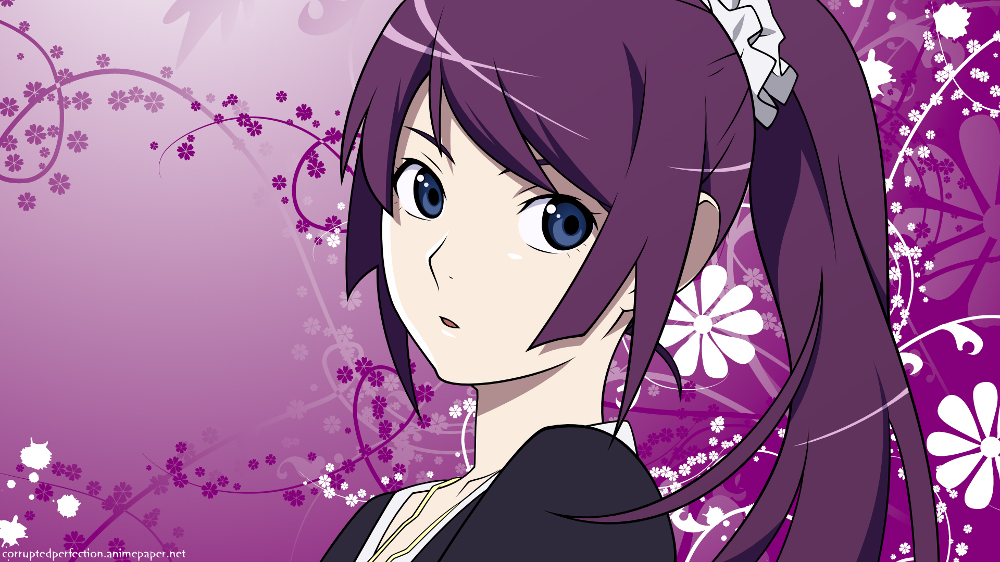
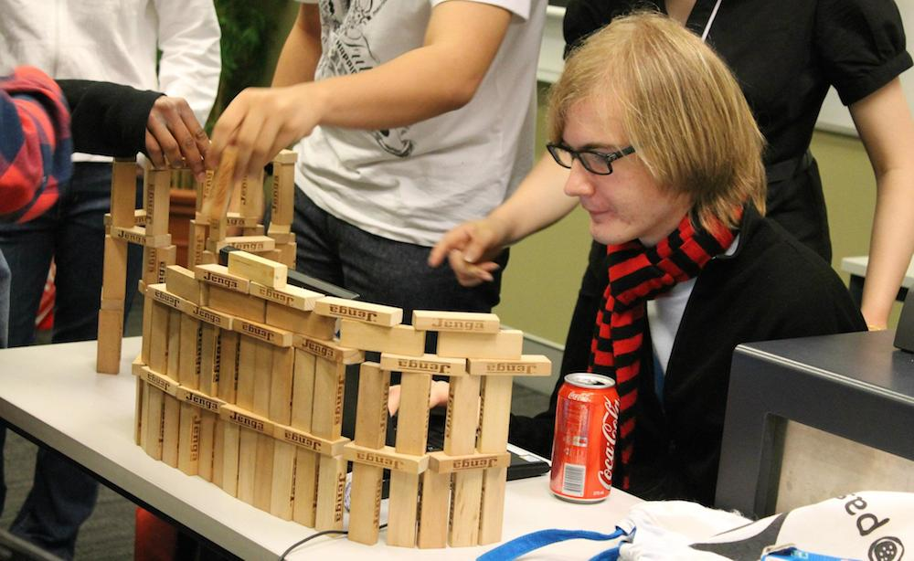

I don't write about people, heck I don't even talk to people unless we have something in common. There are only a few people that have had a big influence on my life, I call them my sempais, my shishos, my senseis, my mentors. This post is kind of like a [reply](http://rubenerd.com/vadim-brodski/) post, but also as a thank you post.

Embarrassing, Shy, Socially awkward. Yes those are words that would fit us well, don't you agree Ruben? But yet, we somehow managed to talk to each other and start this ball rolling, and hey, I could't have wished for a better first university friend then you!

---**First encounter**

So I walk into my first real university class, which was a lecture on Communication for IT professionals, and I decide that I should sit at the front of the room (second row to be exact) cause, you know, you don't want to miss anything as university is serious business, unlike high school. And since I didn't really have any friends and was a shy guy, I sat alone, and I hope no one would sit next to me. To my surprise a talk geeky looking blond guy decided to occupy the seat closer to the window, 2 seats away from me. I figured since this is a lecture, it shouldn't matter cause we won't have to talk anyway. Oh boy was I wrong.

Soon the lecturer said that we need to talk to the person beside us about some topic (which I completely forgot). Well now I'll have to speak to this Aussie looking guy. To my surprise we had a nice talk and at some point during the conversation I must have pulled out my ... phone and he noticed that I had Kyubey there (he was my avatar at the point, so he was both on my Facebook and Google+). He not only noticed, but also recognized the character and said: "Thats from Madoka Magika right?". I was surprised, shocked, astonished, bewildered and other synonyms of this word. This person sitting next to me know one of my favorite shows, not only that he had watched it! He introduced himself to be Ruben Schade and, well, at that point I added him on Google+ (screw Google+) and started talking to him about more and more anime. Including, but not limited to those with cute lolis and KugiRie.

**Some time later....**

Since Ruben was also (technically) a first year student, we were together in pretty much all the subjects! By spending our uni days together we became closer friends, and my respect for him grew, he was like a sempai to me, like someone I want to be when I am that old (aside from the being at uni part). He introduced me to Kyary's PON PON PON and got me so hooked on it, I couldn't stop. He opened up the doors of the IT world to me, especially security wise. After meeting Ruben, I understood that "I don't know nothing!" (German K. 2005). I respected him and looked up to him (I still do!). Anyway, since he was pretty much my only anime loving friend, I wished to expand that circle and so I managed to find out that UTS has and anime club! So I dragged him there, to the 27th, or whatever it was, floor of the Tower for a friday screening where we watched Friday... and GTO drama. We met Alex, the soon to be president, Seb the potato and Clara the tweetmaster. We joined the club, and hey, now he is webmaster, I am screenings director.

**Still here**

Now 3 birthdays and 6 semesters down the road, we are still close, still enjoying uni life (well I am in Japan and Ruben is working XD). Whats important that we got to spend time with people who shared common interests, got to make friends with some amazing potatoes (I mean people) and Ruben even scored in the personal live department thanks to that one small event. I guess if we didn't join the club we would still be close, but our lives would be different. If we hadn't met, I doubt I would have got to enjoy such a fulfilling university life. Thanks to you, Ruben, I joined Twitter and now use it regularly; Thanks to you, I started to treat security more seriously; Thanks to you I got a better understanding of how the industry work, Thanks to you I started this blog and am still writing it 2 years down the road; Thank you for helping me understand how to get my own domain, how to get server hosting, and how to set up everything I needed for the creating of my blog; Thank you for giving me an idol figure who I can look up to and to aim to be as good as you one day. I put in effort to improve only if there is competition, if there is someone there who is better then me, you were, you still are and I thank you for being there in my life.

I love you Ruben.

\------> #nohomo <------
