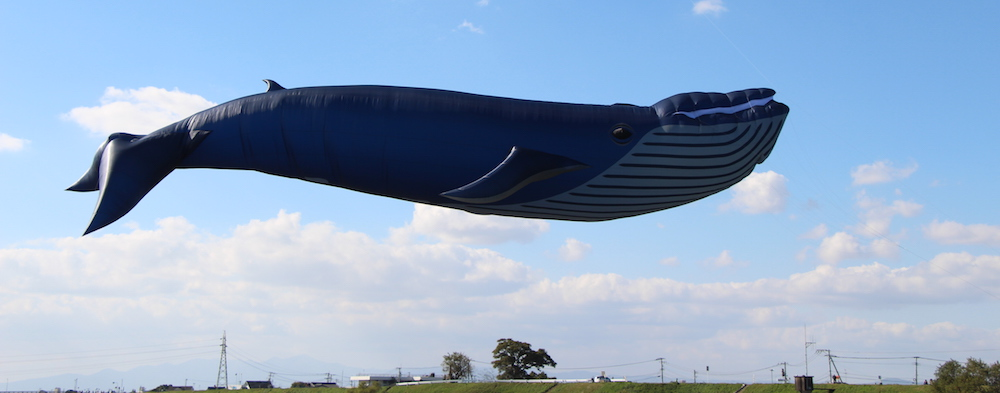

 This weekend there was a big balloon festival in Saga and of course I went there to check it out. Only problem was that there were no balloons.

---

Its sad, because the weather was pretty bad at the end of the week and it was just pouring on Saturday and Sunday. Even when the skies cleared up by Monday, the balloons weren't allowed to be up in the air, as the winds were too strong, making it near impossible to control them. Though they did fly at 6am, which we missed, cause we were asleep.

There were stalls like at any festival and a lot of people! We got to see a giant whale and a night show using just the burners. Also today we went to the city of Karatsu, for a festival called Karatsu Kunchi. Don't know what its about, but its pretty big and the floats were cool.

My photos here:

