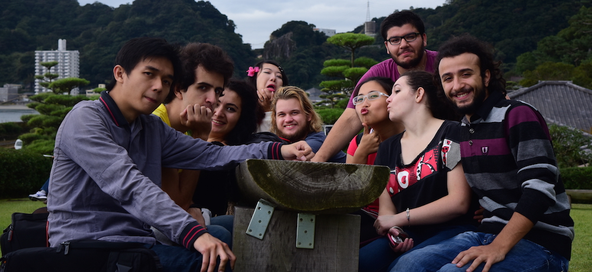

Kagoshima city may be small in comparison to Tokyo or Osaka, but because of that you can enjoy traditional Japan much more, than if you were in a metropolis. Todays outing was just that, a trip to the traditional gardens of [senganen](http://www.senganen.jp/en/top/) in the north of Kagoshima, where they are currently holding a chrysanthemum festival.

---

The flowers were gorgeous, aside form the ones which were covered in ash from Sakurajima, seeing those was sad, poor flowers. Even though the weather was cloudy at first, it cleared up by midday, giving us an opportunity to take great photos! Oh and many photos were taken. We had like 4 people with really good cameras, so expect to see a lot of awesome photos uploaded in the next few days to our foreigners of kagoshima university group Photo Stream: [Gayjin Gang](https://www.icloud.com/photostream/#A2GY8gBYGMFr4K).

For my personal photos (and a few ones I took from the group Photo Stream cause I really like them):

