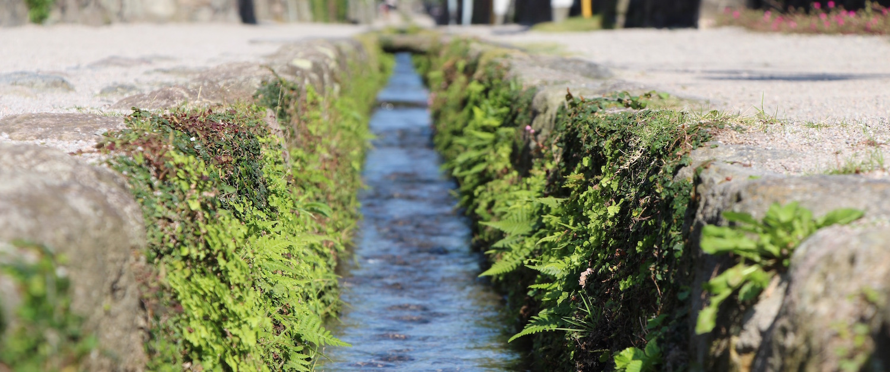

This weekend I spent together with my good friend [Tac](http://tacyip.com), who is currently working as a English teacher in the city of Shimabara as part of the [JET program](http://tacyip.com/?p=47). We went around the city, a nearby hot spring and Nagasaki city.

---The area is pretty remote so getting to required a Shinkansen, bus, ferry and train. Shimabara city is located a bit east of Nagasaki, on a peninsula near the centre of Kyushu island. But being so far from big cities it has a countryside charm which you can't find in big cities like Tokyo or Osaka. Small roads, nature, quiet surroundings and beautiful old architecture. Also we went into a small cafe which served mochi, but that wasn't the main feature, that place had a million cats! Maneki neko on shelves everywhere. You could buy any one of them and the biggest, and coolest one in my opinion, was 2000$. We also went to the nearby town of Unzen, which if famous for its hot springs (which you can see in the photos). And I managed to set a record, 28222 steps walked (22.3km), it was a looooong day.

Visiting the place was really nice, but it was much nicer to get to chat the whole day to a friend who understands you well. Thanks for showing me around and bearing with my long photography sessions Tac. It was an awesome trip. As I said, Shimabara is a beautiful place to visit for a day or two, but staying longer would be kinda boring. So try to make the most of your time there, have fun with the kids and look forward to traveling around in the future.

Oh! We also went to Nagasaki, where we saw the bombing museum, chinatown and a lot of temples. It was interesting to learn about what happened in Nagasaki in 1945, in addition to what I already knew and learned from [Hiroshima](/posts/2014/hiroshima-広島/ 'Hiroshima – 広島').

I love doing these kind of small weekend trips, especially with friends. Too bad it is much harder to do that in Australia as everything is far and expensive. Thats why I plan to travel as much as I can while I am here, in Japan.

Photos:

