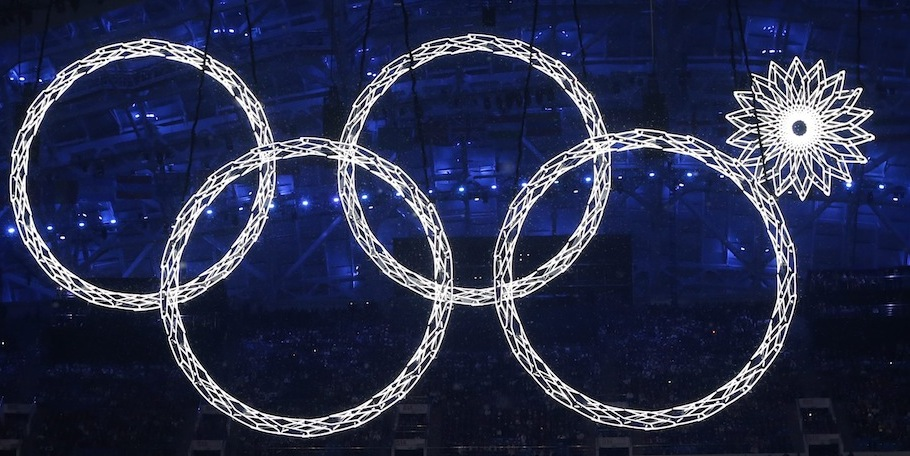

The 22nd winter Olympic Games have just begun in Sochi Russia! For any country hosting an Olympic Games is a great honor and Russia hasn't had a chance since the 1980 summer Olympics in Moscow. Its been tough on Russia, they had to building all the venues and hotels from scratch, spending an amazing 51 billion dollars on infrastructure, new stadiums and hotels. But they managed to get all of it done on time (almost) and they Olympics have officially begun a few days ago with the amazing opening ceremony, which showcased the history of Russia with beautiful ballet and performances.

<!--more-->But it did not all go according to plan. One of the simplest pieces of the opening ceremony did not quite open up, so to say. Look:

This image is all over the internet, it even became the logo of the [#sochiproblems](http://www.reddit.com/r/sochiproblems) subreddit. Aside from this small blunder, everything else was beautifully executed. It was so worth waking up at 3am to watch.

Well I am mainly rooting for the Russian team as it is their home ground, they need to win! Also the Latvian team and the Japanese team are in my top. Australia though, it would be pretty cool if they won something, but I doubt they will. They did though in 2002, in a very very very [interesting manner](https://www.youtube.com/watch?feature=player_detailpage&v=fAADWfJO2qM#t=93).

Good luck to all athletes!
