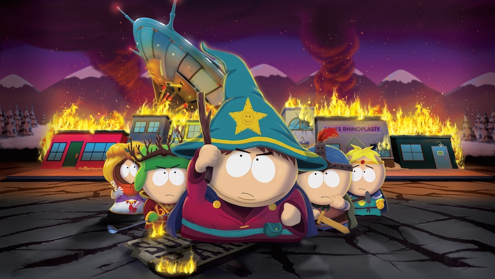

They announced it at [E3 2012](http://jamiejakov.lv/games/e3-2012/ 'E3 2012 and all its goodies'), they showed a glimpse of it at [EB Expo 2012](http://jamiejakov.lv/games/eb-expo-2012/ 'EB EXPO 2012'), and now, almost 1 and a half year later, it is out! And wow what a game it is! So [South Park The Stick of Truth](http://southpark.ubi.com/stickoftruth/) is an RPG where you play as the new kid in town who just arrived and is trying to make friends with the local boys (and girls). During his adventures, sir Douchebag (thats the name you are given) must help the human kingdom, led by the Grand Wisard Cartman, take back from the Elves, led by Hight Elf Kyle, the ancient relic of immense power - the Stick of Truth. No spoiler version.

<!--more-->The game is done in the same style as the cartoon itself, so 2D draw characters bouncing up and down while walking and speaking as if they were made from paper (which they were back in the day). The voices are done by the original cast of the series, so that is great! The game brings back so many good memories of the show, and it has references to pretty much all the side characters and events that happened throughout the last 17 seasons.

Without going into too much detail (and spoilers) of the game, I can just say that anyone who plays it should definitely explore the city (and Canada), try to get as much money as you can, and don't sell anything (you get an achievement). Also doing all the side quests is fun, cause you get to meet Mr. Hankey and Mr. Slave and Jesus and Manbearpig!

I would recommend that anyone who has been following the series should play this game as it pretty much adds 3-4 more episodes worth of story to the overall plot of the show. But play it after watching the 3 Game of Thrones episodes of South Park season 17.

**8/10**
