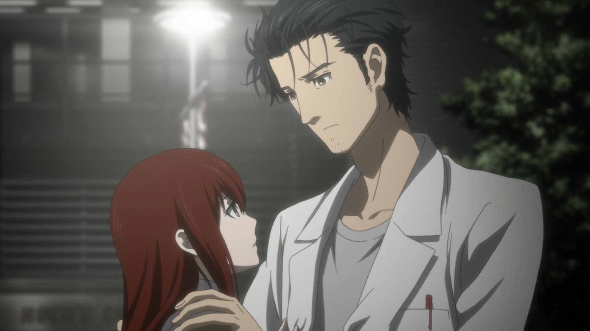

Back in 2011 [I wrote a review](http://jamiejakov.lv/anime/steinsgate-review/) of _Steins;Gate_, a series that I really enjoyed watching and gave it a 10 straight away and I even said that it was the best time travel story told in anime. Now, 2 years later, 7 months after the movie came out in cinemas I ordered the Blu-Ray and today we had a screening with the anime clubs of UTS, USyd and UNSW. It was a grand event, around 50 people showed up to watch this awesome movie. Anyway to the review.

**\*\*\*\* CAUTION SPOILERS AHEAD \*\*\*\***

---

Ok I can't not compare the movie to the series it self. And in all honesty its not as good as the 26 episode series, but that is understandable as it is only 1 hour and a half, whereas the series is around 10 hours. [_Fuka Ryouiki no Deja vu_](http://myanimelist.net/anime/11577/Steins;Gate:_Fuka_Ryouiki_no_Déjà_vu) starts in the Steins;Gate world line where Mayushii is alive and Kurisu was not stabbed to death by her father. Everything seems fine and they are all living a happy life. But then suddenly Okabe starts seeing these delusions of events that have happened in other world lines. They start getting more and more serious up until he completely loses track of the world lines and disappears into the timeline which is 0.00000001 off from the Steins;Gate one. And the only person that still manages to somehow remember Kyoumas existence is his beloved tsundere Kurisu. It's all up to her to bring him back!

During the series we got to see the evolution of the plot, the character development and the resolution of a complex time travel mystery that was played for us. In the movie though none of this was present, the characters have reached the pinnacle of their development, the story is at its finale as well and the plot twist that needs resolving gets solved in 5 minutes by embedding a strong memory in Okabes head - his first kiss with Kurisu. The movie was made to entertain us, to give us that warm feeling that the lab members are back and they are still as funny as ever. But as far as story or plot goes, there was pretty much nothing new. All the concepts have already been established and they are playing on the fact that all the characters kinda have their memories from other word lines because of Okabe.

It was entertaining to watch and I would definitely recommend it to all the Steins;Gate fans out there. However personally I wished they would have something more thrilling, some new plot points, and twists, with a marvellous resolution at the end. But it was a good movie nevertheless. Also special mentions to the OP and ED, they were both great and I will add them to my music collection.

In the end I decided to give it a **8/10**

