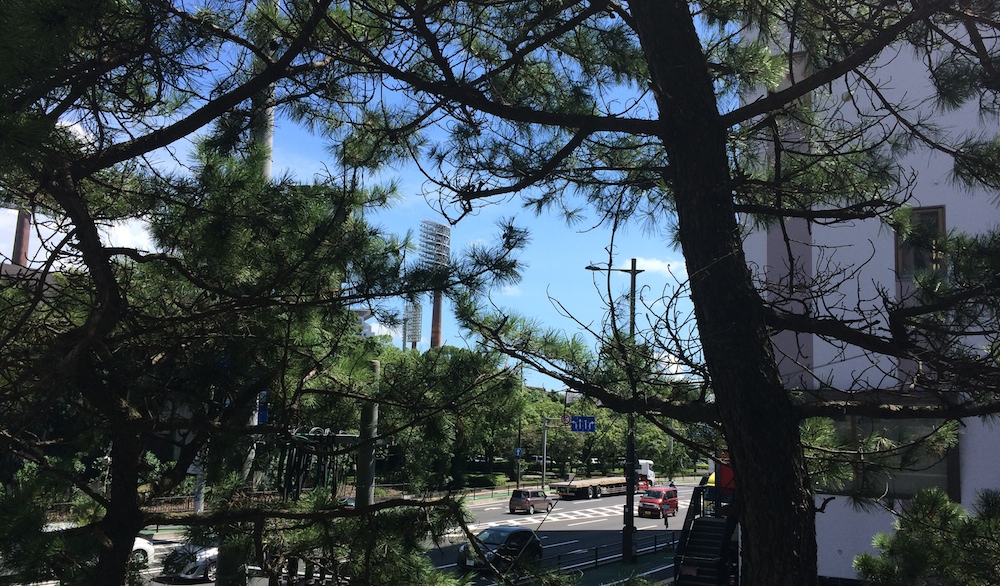

Exams are over, semester is done, time to go outside and have fun in the beautiful weather, unless you have a typhoon coming (yes we are gonna get hit in the next few days). My parents are one the way to me now and we are going to start our fun summer vacation. Unlike previous years this holiday will be rather different. First the length: we are going to start traveling now and only finish on the 31st of August, so thats almost a month. And second is Amy: she is playing part in this years travels, both with my parents and me with her parents. So here are our plans:

- 6-8: Kagoshima
- 8-13: [Ibusuki](http://jamiejakov.lv/travel/ibusuki/ 'Ibusuki') - Iwasaki Beach Resort
- 13-18: [Tokyo](https://www.flickr.com/photos/jamiejakov/sets/72157646176820140/) (parents leave on the 15th) [Comiket](http://jamiejakov.lv/anime/comiket-86/ 'Comiket 86')
- 21-26: [Korea](http://jamiejakov.lv/travel/korea/ 'Korea') - Busan, Seoul
- 26-31: Osaka - [Magical Mirai concert](http://jamiejakov.lv/technology/magical-mirai-2014/ 'Magical Mirai 2014')

The september is gonna be very interesting as well, lots of free time to spend with my dearest person.

To my Sydney people I wish good luck with your semester, to my Japanese friends I wish you to enjoy your holidays as much as I am. And to my internet friends, there are always games to play and anime to watch.
