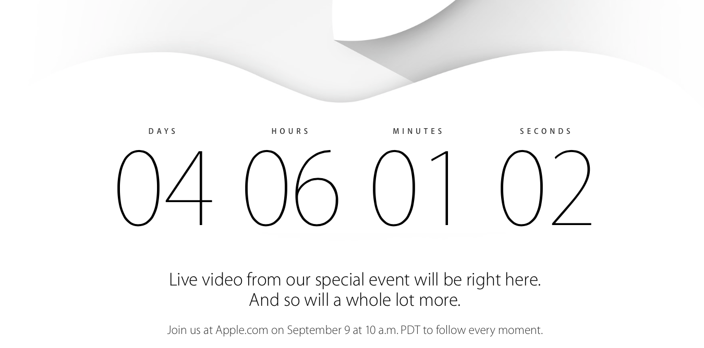

We all knew it was coming, but we probably have no idea how little know, and what to expect. I am of course talking about the September 9th Apple Keynote. Every year Apple has held a Keynote around this time in September to introduce their new hardware, more specifically new iPhones. We (by we I mean all the denizens of the internet and beyond) were all guessing that this year won't be different. Oh boy, were we wrong. Well I can't say for a fact yet, but come September 10th 2-4am Japan time, and I will be able to say that we were.

---Judging by pure speculation, rumors and leaks that we have gotten over the past months from [various sources](http://9to5mac.com), we can assume that the new iPhone 6 will be debuted in 4 days time. Also there are rumors that Apples new wearable (iWatch as it is known among us) will be introduced as well. We knew this a few months ago, but now we have more. Apple send out invitations to this event, mentioning that it will be at a completely different venue from where they usually hold this event. Not only is this venue 3 times bigger, but it is also where Steve Jobs unveiled the first Macintosh and the first iMac. It has significance. Furthermore, they build a [3 story high structure](http://9to5mac.com/2014/09/04/drones-eye-view-of-flint-center-highlights-the-mysterious-structure-apple-is-building-next-to-theater-venue/) right next to the venue building, and have strict security around it. If this is not suspicious, I don't know what is. Lastly, Apple made a countdown till the Keynote on [their website](http://www.apple.com/live/). They have never done this! They even used to ban people for live streaming events, but are now streaming the events themselves. Of course they have streamed them on their website before, but they never included a timer or written phrases like: "Wish we could say more" or "and so will a lot more", these clearly indicate that the Keynote won't just be iPhones. A close friend of Tim Cook has tweeted this:

<blockquote class="twitter-tweet" align="center" lang="en">
Holy shit people, hang on to your hats, this is going to be a wild ride.
— Jim Dalrymple (@jdalrymple) <a href="https://twitter.com/jdalrymple/status/505047719463763968">August 28, 2014</a></blockquote>

They hyped this up, it better live up to our expectations.
