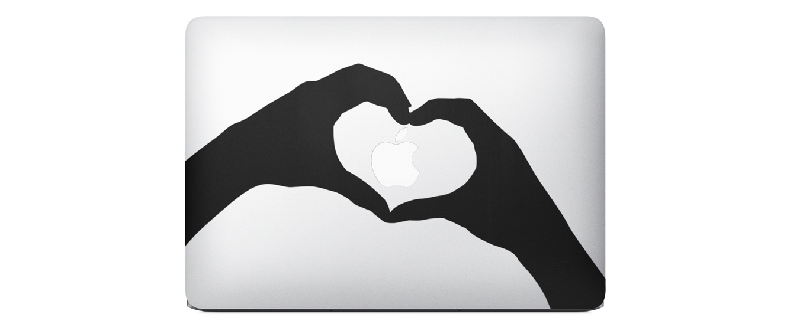

Apple just released a new ad showing their MacBook lineup. But not like other tech companies, they did not focus on the tech specs, or trying to explain how why their computer is superior to the competition, no. They just showed up how people, most likely young people, decorate their laptops with decals (vinyls, stickers). Simple message: our laptop is hip, our laptop is popular with teenagers and students, cause they can be creative.

And thats exactly why I love Apple.

Here is the video: [Stickers](http://www.apple.com/macbook-air/stickers/index.html#video-stickers)
