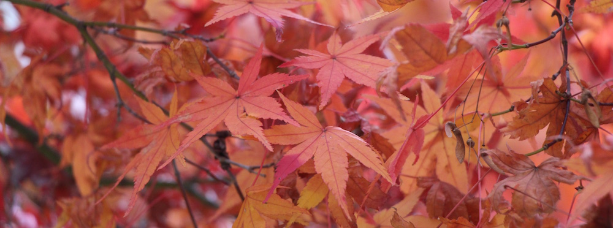

One day, I receive a message from our Turkish gaijin Burak saying that we are going to Kirishima. It was rather spontaneous, but I am not the kind of person to decline an invitation to a trip, especially if I have never been to the place before. The reason for this trip was simple: to see the beautiful red leaves that cover Japanese trees in Autumn. And so we hired a car and drove to the Kirishima Jingu (shrine). Another trip together with the Gaijin Gang.

---To our surprise, there were not as many leaves as we had hoped. Thought we did manage to take a lot of gorgeous photos of the shire and the nature around it. There was also a small pond next to the second building of the shire. That pond reminded me of all those Japanese movies, or Hollywood movies portraying Japan. tranquil, untouched, and looming above it was a tree covered in red leaves. #utsukushii

Some of the photos in the following album were not taken by me, and you can probably tell by the sudden change from a Canon camera to a Nikon one (in the metadata of each photo there is info about the camera). Those were taking by the talented Turk photographer - Burak and his 4000$ camera.

Link:

