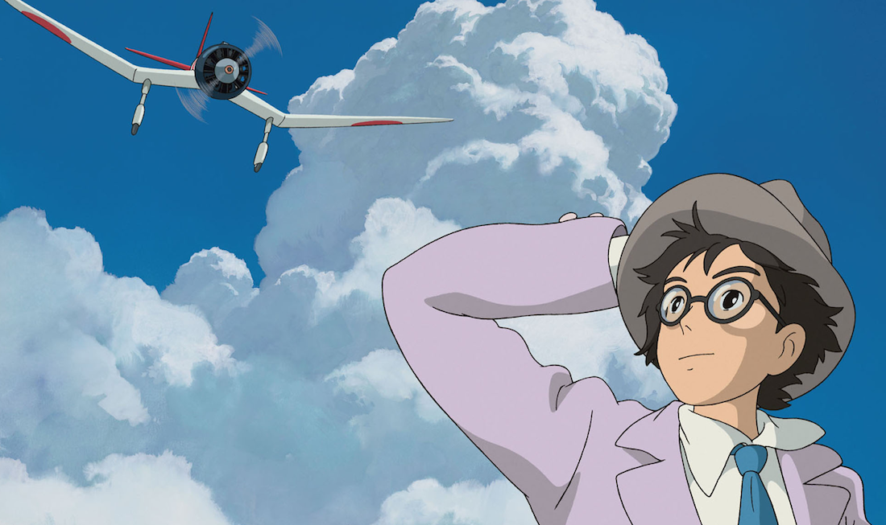
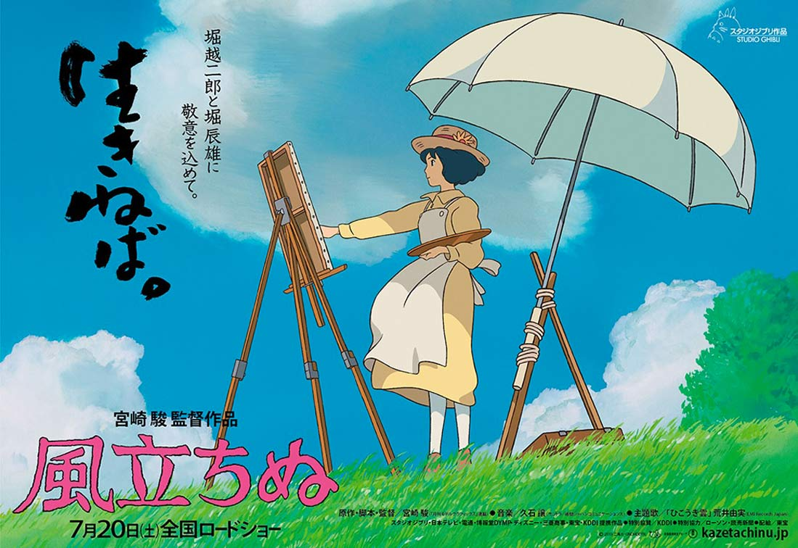

When thinking of the works of award winning director - Hayao Miyazaki you would normally think of his amazing fairy tale type movies like _[My Neighbour Totoro](http://myanimelist.net/anime/523/Tonari_no_Totoro)_, [_Spirited Away_](http://myanimelist.net/anime/199/Sen_to_Chihiro_no_Kamikakushi) or _[Howls Moving Castle](http://myanimelist.net/anime/431/Howl_no_Ugoku_Shiro)._ They are all similar in the sense that they are set out in a somewhat realistic world with elements of magic and mystery and these become the predominant aspects of the story, which create the unforgettable feeling of a Studio Ghibli Movie. _[The Wind Rises](http://myanimelist.net/anime/16662/Kaze_Tachinu)_ (風立ちぬ), however differs from the tradition fantasy genre and is based on a true story of a [Jiro Horikoshi](http://en.wikipedia.org/wiki/Jiro_Horikoshi), an aerospace engineer, who's dream was to create beautiful planes that would surpass the German designs in both speed and power. Even though the setting is in real life World War I and then World War II Japan, this touching story of a young boys dream, dedication to work, search for perfection, love and despair is one of the best works of Director Miyazaki. It really shows us, just how fragile a human life really is.

<!--more-->**Plot:**

The movie starts off with Jiro's life as a Japanese kid (日本の少年), who wants to soar through the skies on a plane, but can't due to his shortsightedness and glasses. After borrowing a magazine about airplanes and their designers and engineers, our young Jiro starts seeing dreams where he sees a famous Italian engineer - [Giovanni Caproni](http://en.wikipedia.org/wiki/Giovanni_Battista_Caproni) and is able to not only talk to him about the art of building planes, but also walk inside and outside on the wings of the planes designed by this renowned engineer. These dream sequences help Jiro in achieving his dream of being a plane designer and building the most beautiful aircrafts (#utsukushii).

During his older years, he was traveling by train to Tokyo to go to university. During that train ride, a girl and her maid were traveling home to her family, and this girl helped Jiro out by saving his hat, which was blown away by the rising wind. However the train was caught right in the middle of the [Great Kanto Earthquake](http://en.wikipedia.org/wiki/1923_Great_Kantō_earthquake) and fires in Tokyo. In this the maid who was helping the girl get home, got severely injured and couldn't walk home. Jiro helped the girl and her maid to get home safely, but little did he know that years later that he would find the same girl and fall in love.

Every day for lunch Jiro would it Mackerel, not just because he liked the taste, but also because the bone shapes intrigued him. In the skeleton of this fish he saw the skeleton of a wing of a future fighting jet. He kept this concept in his head for a long long time, until he finally got the opportunity to make a plane with this design. After graduating and getting a job in Mitsubishi, our young adult was assigned to help produce working designs for the next generation of planes. Unfortunately they failed horribly and the Japanese army had to borrow the German wisdom in this regard. But that didn't discourage Jiro as he had a vision and he stayed true to it to the very end.

When going on vacation to a hotel in the mountains there was a beautiful girl standing a top of a hill painting. With the rising wind, fate has brought Jiro together with Naoko, the girl that he helped more then 10 years ago during the earthquake. Not too long after they got engaged and soon after married. But Naoko was sick with Tuberculosis and that was very sad and painful for both of them. But she stayed strong and spent as much time as she could with the love of her life - an aviation engineer.

**Overview:**

As I mentioned before, this movie is rather different from the other Miyazaki films. The Wind Rises is meant for adults. It has serious themes such as future dreams, carrier prospects, love, family, health, and the thin balance of your own career versus spending time with your loved ones. It felt, however that this is the movie that Miyazaki wanted to make. His previous works were amazing and inspirational, but they were more oriented towards the people watching. Whereas with The Wind Rises, it felt as if Miyazaki made it because he himself wanted to watch this movie. This movie is more then just a biography of an engineer, its a story of love and dreams.

**Soundtrack:**

The element of silence and the amazing original sound track played an essential role in portraying the story of Jiro thought his life. When he was interested in Italian airplane design, fun and cheerful music played. When they traveled to Germany, more serious and strong melodies were present. It not only helped enhance the visualization of Jiro's dreams and fantasies, but also gave contrast to the reality of life in 20th century Japan. And the ending theme which played during the credits was a perfect end to a great movie.

**To sum up:**

The Wind Rises is a movie worthy of being called a Hayao Miyazaki masterpiece. Of course it is not as grand as Spirited Away or Hauls Moving Castle, but it is still an amazing movie which I would recommend anyone to watch. Not only does it give an insight of the history of Japan and  its people, but also in to the life of a boy and a girl who had to overcome a lot in their life.

The opportunity to witness this movie was given to me and Andrew from the University of Sydney by the biggest and best anime distributor in Australia: [Madman Entertainment](http://madman.com.au). Thank you and please bring us more amazing movie screenings in the future!

**8.7/10**
