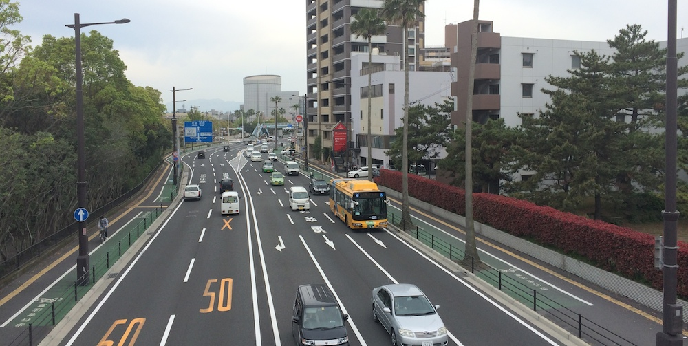
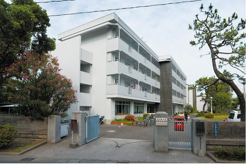
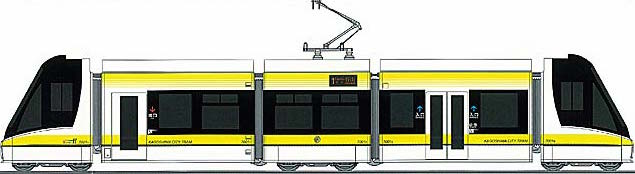

So I've been in Kagoshima for a month and a half now, so I believe that I can give some tips for my kouhais, future UTS students coming to Kagoshima for exchange. Please note, this post will be updated numerous times throughout my ICS period. I also really envy my kouhais, cause I will make sure they get almost everything that I have bought here, as I won't be taking this stuff back to Australia, with the exception of my monitor and rice cooker.

This post will be separated into 3 parts (上中下), which will be released when I have time to write them up.

Lets get to it:

---

**Paperwork**

Japan is very pedantic about paperwork, you have to fill out everything that is required with absolutely correct details (even though none can tell if you fudge something, if you write one thing in one place and different thing in another, they may call you up). For any and all papers there you need to write your name, full name. Yes, middle name, chinese name, etc. full passport name. In my case I have to write Vadims Brodskis everywhere, other people may have to write Melanie Xiang Yan Tay for example. Some forms have a separation by Name and Surname, in Japan you can't have a middle name, so you have to split your middle name and add it either to your name or surname (recommend adding to your name as they will address you by your surname). If you don't have a phone number to give them, make sure to tell them that you just arrived and have yet to make one. If they ask for your address back home, make sure to write it fully with the country and postcode.

The years in Japan are counted in both the normal way (2014) and in the Japanese Calendar (平成26) which marks the year of the emperor. Figure out your birthday in Heisei, 1993 is 平成5. Also all dates are written in the format YYYY/MM/DD so be sure to get it right.

Most official place such as banks and post office will ask for a seal (印鑑) instead of a signature. You can make one at any Inkan shop for around ¥1000. You can only put Katakana, Hiragana or Kanji, so make sure to figure out how to shorten your name to around 2-4 characters. Mine became ワジム. Most of the time it doesn't matter what you put on it, they really don't care cause you are a foreigner. My tutor was shocked when I made it into something that isn't my name, because that is not how you are supposed to do it (furigana for my name is ヴァディムス). Nobody cared, I use it everywhere perfectly fine.

If you are ever unsure when signing (or putting your seal) on any paper, ask your tutor for help. It is their job (and they get paid for it) to help you with these kind of things throughout the year. Be careful with mobile phone contracts and tv contracts as they can be very strict and with a huge cancelation fee if you don't like it. I will have a section on mobile phones later on.

**Accommodation**

You will be staying in the International Student Dormitory (国際交流会館). It has 3 buildings (1,2,3).

- 1 - cheapest, ¥4,000 rent, shared bathroom and kitchen. It will be closed for renovations starting July.
- 2 - ¥6,900 per month rent, shared shower and kitchen.
- 3 - ¥25,000 per month rent, personal studio (bathroom, shower, kitchen included).

As this is 6 times cheaper then living in housing in the center of Sydney (UTS Housing, urbanest, iglu, etc) I decided to go with the 3rd building, which was only built 2 years ago and I am the 2nd resided of this room (previously occupied by Paul sempai from UTS). You can see photos of the room and bathroom in the album at the end of this post.

To pay rent you need to open a bank account in either [Kagoshima Bank (鹿児島銀行)](https://www.kagin.co.jp) or [Japan Post (日本郵便)](https://www.post.japanpost.jp/index.html). The landlord/manager will give you the necessary documents to fill out, and your tutor should help you with opening an account (銀行口座). The bills, such as electricity, water and gas are separate. They will only be ¥1000 per month each, but they need to be paid thought the convenience stores. Its a very easy process, just take the piece of paper which you will get in your mail to the convenience store and pay the amount. Done. In regards to internet, you need to pay ¥12,000 for the whole year, which need to be payed in the beginning of your stay in 2 installments or just once for the whole year. But you get internet connection straight away, so don't worry about not being able to contact home when you arrive.

The 3rd building has 2 laundry machines on each floor for the residents to use, and they are free. Rubbish needs to be separated and put in its respectable containers outside of building 2. Each building has bike parking with a small cover, so you should definitely park you bike there. Same goes for uni, make sure to park you bike under cover, that will protect the metal parts and you bike will be less likely to rust.

Your address for local stuff will be:

890-0056 鹿児島県 鹿児島市 下荒田４丁目５０−２０ 国際交流会館Building Number号館Room Number号室

Or this for International stuff:

_Kokusai Kouryu Kaikan, Building #, Rooom #_ _Shimoarata 4-50-20_ _Kagoshima-shi_ _Kagoshima-ken_ _890-0056_ _Japan_

**Transport**

The city itself has trams and busses, which are relatively cheap;  ¥170 for one trip on a tram, and around ¥200 for a bus ride. The JR line goes from the Kagoshima Central (鹿児島中央駅) north to Kirishima (an further) and south to Ibusuki. Kagoshima itself has a bus service and a tram service. As I have yet to take a bus, I do not know the fare, but it should be around ¥200. One trip on the tram (市電) is ¥170. You can buy an IC card - Rappica to use on busses, trams and some ferries, but I would highly recommend you don't and wait, as you will receive one for free sometime at the end of June (together with ¥50,000 worth of book shop vouchers, which you can chose to spend on books, DVDs or sell them to other people (quietly)).

Kagoshima Central is also the last stop of the Shinkansen (新幹線) - Bullet Train. It goes from Kagoshima all the way to Aomori in the north and they run twice every hour. So you can pretty much just catch one from Kagoshima all the way to Osaka and then change to another one to Tokyo and again change to Aomori. It will take a while and it will cost you. The closest big city which you would want to go to is Fukuoka (福岡), the Shinkansen from Kago to Fuku is a little over ¥10,000 one way. Its not a cheap trip, but there is a cheaper option! JR Kyushu has a [international student pass (留学生パッス)](https://www.jrkyushu.co.jp/english/railpass.html) which covers all of Kyushu and you can use it unlimitedly for 3 days. You can buy it at pretty much any big station for ¥14,000.

There are ferries going to smaller cities like Tarumizu (垂水) and Sakurajima (桜島), as well as islands south of Kagoshima, such as Yakushima (屋久島).

Flights from Kagoshima to various places in Japan are rather cheap if you fly with budget airlines such as [Peach](http://www.flypeach.com/home.aspx) or [Jetstar](http://www.jetstar.com/jp/en/home). Peach only flies to Osaka KIX though, so be careful. JAL and ANA are usually twice if not 3 times more expensive, so be careful of that as well.

The airport is roughly around 45 minutes away from Kagoshima Central by Limousine bus and is ¥1250. Make sure to take it when you just arrive as taxis will be really expensive. Going from Kagoshima Central to the International Student Dormitory is not as simple. You can either take a tram to Korimoto (郡元) and then walk for 10 minutes, or change two busses and walk, or just take a taxi and pay around ¥1200.

Your best friend will be Google Maps and it has everything you might need and want in terms of traveling. The times are correct and the suggestions are perfect. There is another App which has even more features which is called Yahoo乗換案内. It is available for both iOS and Android for free, so check it out.
