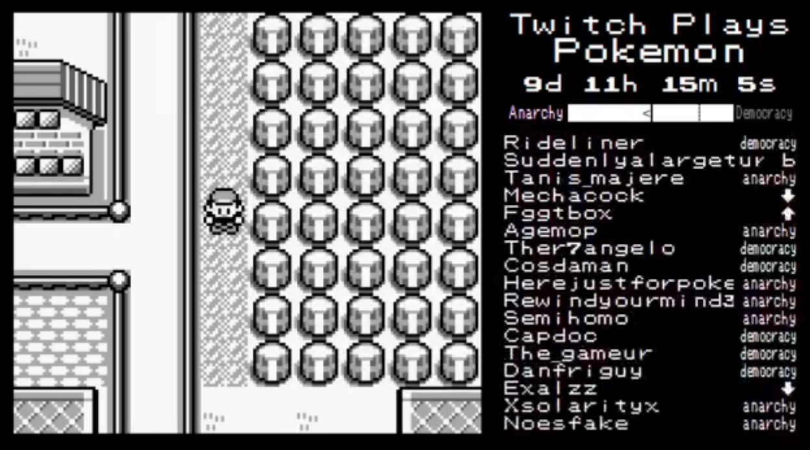
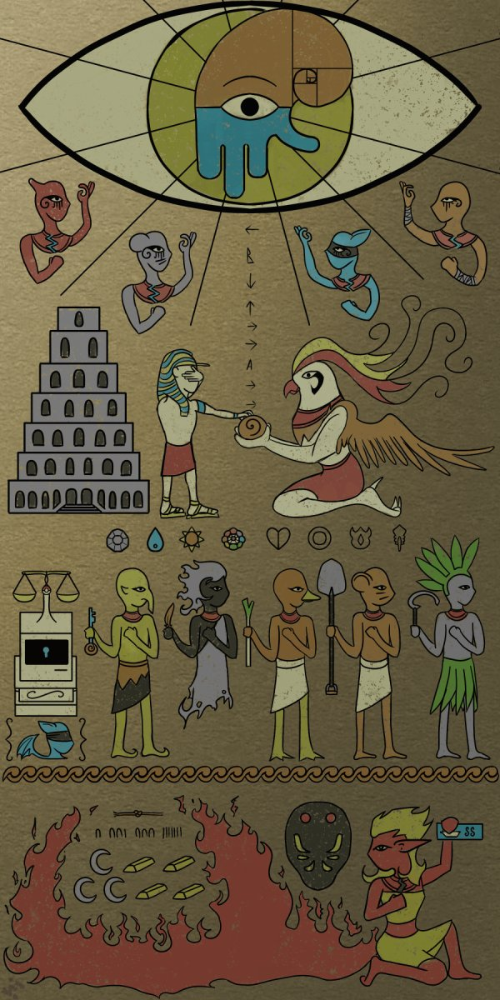
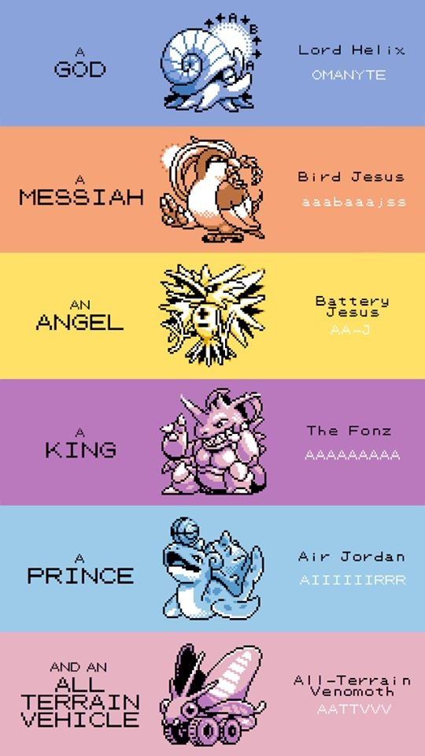
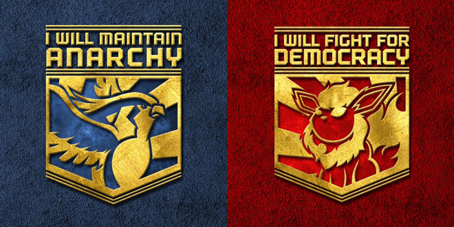

If you don't know what this is, I think it is time to climb from under the rock you have been hiding for the past 2 weeks and start watching & participating! This is not just Pokemon, oh no, this is much more. As [Wikipedia](http://en.wikipedia.org/wiki/Twitch_Plays_Pokémon) put it, Twitch Plays Pokemon (TPP) is a social experiment, I'd say it has become a social phenomenon. Basically what TPP is, it is a stream of a Pokemon Blue game modified to accept the commands typed into the chat of the stream by the people who are watching, thus making them the players. As this idea is new and original, the concept became super popular and thus amassed over 70,000 people to play at a time (though it has died down and only 30,000 are playing at the moment, but still!).

---

If you have played Pokemon when you were young, you would know how hard it is to beat the gym leaders, how complicated some of the mazes are and how much time it requires to pass the whole game. Well now imagine that there are another 49,999 people playing the same character together with you, and each one of them has a different idea of what we should do. Thus resulting in utter chaos and confusion, but also massive fun!

What is more astounding then the concept of the game, is the sheer number of memes and original fan art which was created based on the progress of the game. Memes were based on the Pokemon which were added to the team, events that lead to sacrifices and hard obstacles. The Pokemon have all been given nicknames based on what they were named in game and all have been given a role in the party. Most notable characters being the Helix fossil - our god, bird jesus - our saviour and the false prophet Flarion.

[Know Your Meme](http://knowyourmeme.com/memes/events/twitch-plays-pokemon) has all of the popular memes written down and explained for all of you guys who either haven't been following TPP or have no idea why they are calling the 23rd of February - Bloody Sunday.

The main reason why people like TPP and why it has become so insanely popular is due to that fact that absolutely anyone can contribute to the success and progress of the game, and absolutely anyone can troll the players and make sure they fail. Both of these aspects are what make it fun to watch and play.

This is their current team with Lord Helix already evolved into [Omastar](<http://bulbapedia.bulbagarden.net/wiki/Omastar_(Pokémon)>). At the time of writing this post they have been playing for 15 days and 10 hours, have collected all 8 badges and are on the way to Victory road. However the team is a little underpowered so they need to level them up a bit beforehand. Let the grinding begin!

PS: **Praise the Helix**.

UPDATE: On the 1st of March at approximately 9pm Sydney time, they have defeated the elite 4 and Blue! This day will forever be knows as Helix Day!

