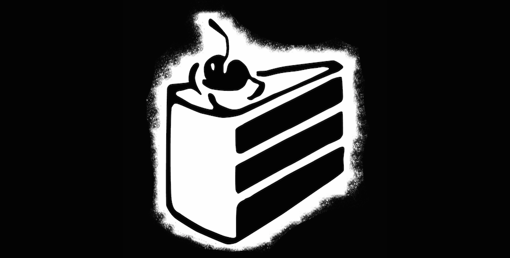

Wow, I can't believe that it has already been 2 years since I set up this blog and made [my first post](http://jamiejakov.lv/technology/japanese-app-update-first-blog-post/). It has been a long ride, and I can only look back the past with sweet memories of writing up these blog posts that mostly consist of my own opinions or just random cool stuff. Like for example last year instead of celebrating a year of blogging, I was too busy being excited for [Armikrog](http://jamiejakov.lv/games/armikrog/)! (which still hasn't come out)

My blog made a long way... I changed domains twice, changed to private hosting, and had [3 theme design changes](http://jamiejakov.lv/life/new-logo-design-life/ 'New logo, new design, new life!'). Not only did my blogs design improve with the improvement of my HTML and CSS skills, but also the content has become more interesting and more consistent. I have improved as a writer, and I am more willing to voice my own opinion.

All of this is thanks to [Ruben](http://rubenerd.com), who inspired me to start blogging. Ruben, you will be getting a few surprises from me soon™.

Tonikaku, Happy birthday jamiejakov.lv (.lv .com). Lets make a lot more good memories together!
