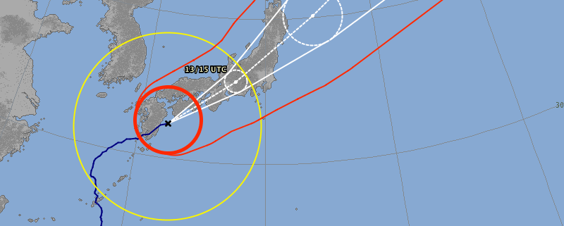

Another day another typhoon warning. And believe it or not, this is normal in Japan. Typhoon VongFong has made landfall onto Kyuushu at 9am this morning and is slowly making its way towards the rest of Japan. This is the 19th typhoon to affect Japan this year. Trust me, thats a lot.

When it first made the news, they were saying that its the strongest this year, that its a super typhoon. The university even cancelled all the classes! Well it reached Kagoshima this morning and went right through us, but aside from a bit of wind and rain, it was a pretty normal day. When the eye of storm was right above the city, it was beautiful. The sun was shining brightly, there were no clouds, no wind, no rain. Then 30 minutes later it went back to being all cloudy and moist.

And as previously, we ask ourselves, why did they make such a big deal if it was barely any different from a rainy day? I guess after years of being ravaged by typhoons, the people of Japan take them much more serious now. Whats important is that we are ok, and are going back to uni tomorrow.
