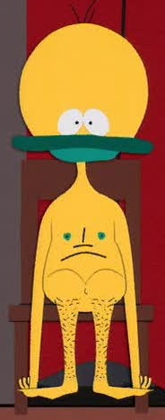

I have been asked this question multiple times, and would always give a tl;dr version. Now I can finally tell the story in full.

So where did this obscure nickname come from? It all began a long time ago when I just started going to [Klass English Language School](http://www.klass.lv) back home in Riga. It's wasn't really me learning English, it was more of practicing it, so that I wouldn't forget. Anyway, the real reason I got given this nickname is because of a peculiarity in pronouncing my name in English vs Russian. For English speakers, pronouncing my real name (Vadim) isn't too hard, just a bit awkward as the name is unusual for this part of the world. For Russian speakers however, pronouncing my name naturally, in English, is very hard, as they are used to the Russian pronunciation. So as a result, they end up saying it with Russian pronunciation, and thus messing up the whole sentence due to the changes between Russian and English pronunciations. Thats when I realised that, I needed a solution for this.

---

One of my sempai's from the school - Oleg, one day decided that my name is too awkward to pronounce, and made it his goal to find me a more.... English nickname. One day he proclaimed that I look like Jamie, talk like Jamie and act like Jamie, so I must be Jamie! That puzzled me greatly, as I had no clue what he was talking about. After a detailed explanation that the Jamie he was referring to is from the Cartoon Network show [_MegasXLR_](http://en.wikipedia.org/wiki/Megas_XLR), I understood where he was going with that. At first I opposed, I didn't like it, but my fate was sealed. From then on in, I was known as Jamie. That became my nickname which I used in games on my PC.

https://www.youtube.com/watch?v=iwTydFBtdBY

Somewhere around that time I finally got an internet connection in my house and I started playing games online. I quickly came to realisation that my nickname, Jamie, has been taken pretty much on every website and online game. Once again I found myself with a problem in need of solving.

"What can I do to still keep Jamie, but to make it more unique?" - I thought to myself. Then it hit me! I needed an extension to my nickname. I didn't want numbers at the end, and none of that randomness. "So where should I look for a good extension to Jamie?" - I kept on thinking.

Around that time I also started watching _[South Park](http://www.southparkstudios.com)._ In season 3 episode 5, a certain creature named Jakovasaur made its appearance. That's when it hit me.  Jamie Jakov - JJ. PERFECT! It was unique, it was easy to remember, easy to pronounce (if needed), and allowed me to get JJ. From that point on all my online presence was summed up with this nickname - jamiejakov.

People say they are sometimes embarrassed of the nicknames and later on - emails, which they created for themselves when they were younger, when the internet was just picking up. I am not. I am proud of how it turned out and that I am still using it and will be using it in the foreseeable future.
