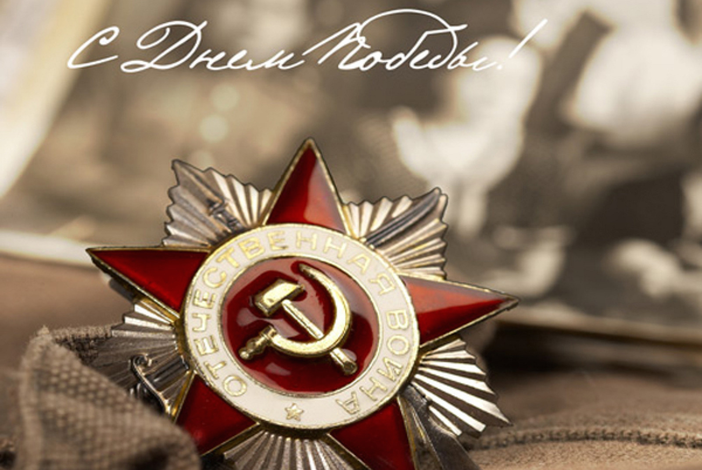

Вот Девятое мая настало, И поздравить мы всех поспешим С тем, что гнета фашистов не стало, И народ наш непобедим. Мы желаем всем думать о мире, Но и помнить всегда о войне. Улыбайтесь сегодня пошире — День Победы на нашей земле! _Автор: Наталья Сухомлин_
