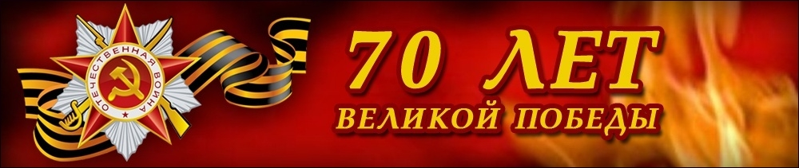

С праздником Победы, славным, легендарным, Пусть Господь дарует мир на всей земле, Не затухнет память в сердце благодарном, Не тускнеет злато на гербовом орле! Поколение новых гениев, талантов, Пусть рождает снова гордый отчий край, И под песни детства и под бой курантов Согревает душу пусть победный май!
